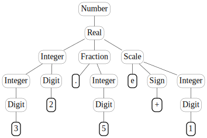

.. _examples:

Examples
========

To give a thorough example of what the library allows to implement, in
this `Jupyter <https://jupyter.org/>`__ session we follow rather
faitfully some Sections of `Parsing
Techniques <https://dickgrune.com//Books/PTAPG_2nd_Edition/>`__, an
eccellent book on parsing by Dick Grune and Ceriel J.H. Jacobs. We can
omit many details (such as defintions, proofs, careful algorithm
explanations…) but the interested reader can still find in such text a
very precise, clear and conceputal description of the ideas behind the
code implemented in the following examples.

Type 1 grammars and production graphs
-------------------------------------

Let’s start defining a *monotonic* grammar for :math:`a^nb^nc^n`

.. code:: ipython3

    from liblet import Grammar
    
    G = Grammar.from_string("""
    S -> a b c
    S -> a S Q
    b Q c -> b b c c
    c Q -> Q c
    """, False)
    
    G

.. parsed-literal::

    Grammar(N={Q, S}, T={a, b, c}, P=(S -> a b c, S -> a S Q, b Q c -> b b c c, c Q -> Q c), S=S)

Productions are conveniently represented as a table, with numbered
alternatives.

.. code:: ipython3

    G.P

.. raw:: html

    <table><tr><th><pre>S</pre><td style="text-align:left"><pre>a b c(0) | a S Q(1)</pre><tr><th><pre>b Q c</pre><td style="text-align:left"><pre>b b c c(2)</pre><tr><th><pre>c Q</pre><td style="text-align:left"><pre>Q c(3)</pre></table>

It’s now time to create a *derivation* of :math:`a^2b^2c^2`

.. code:: ipython3

    from liblet import Derivation
    
    d = Derivation(G).step(1, 0).step(0, 1).step(3, 3).step(2, 2)
    d

.. parsed-literal::

    S -> a S Q -> a a b c Q -> a a b Q c -> a a b b c c

It can be quite illuminating to see the *production graph* for such
derivation

.. code:: ipython3

    from liblet import ProductionGraph
    
    ProductionGraph(d)

.. image:: examples_files/examples_8_0.svg

Context-free grammars and ambiguity
-----------------------------------

Assume we want to experiment with an ambiguous grammar and look for two
different leftmost derivation of the same sentence.

To this aim, let’s consider the following grammar and a short derivation
leading to and addition of three terminals

.. code:: ipython3

    G = Grammar.from_string("""
    E -> E + E
    E -> E * E
    E -> i
    """)
    
    d = Derivation(G).step(0, 0).step(0, 0)
    d

.. parsed-literal::

    E -> E + E -> E + E + E

What are the possible steps at this point? The ``possible_steps`` method
comes in handy, here is a (numbered) table of pairs :math:`(p, q)` where
:math:`p` is production number and :math:`q` the position of the
nonterminal that can be substituted:

.. code:: ipython3

    possible_steps = list(d.possible_steps())

.. code:: ipython3

    from liblet import iter2table
    
    iter2table(possible_steps)

.. raw:: html

    <table><tr><th style="text-align:left">0<td style="text-align:left"><pre>(0, 0)</pre>
    <tr><th style="text-align:left">1<td style="text-align:left"><pre>(0, 2)</pre>
    <tr><th style="text-align:left">2<td style="text-align:left"><pre>(0, 4)</pre>
    <tr><th style="text-align:left">3<td style="text-align:left"><pre>(1, 0)</pre>
    <tr><th style="text-align:left">4<td style="text-align:left"><pre>(1, 2)</pre>
    <tr><th style="text-align:left">5<td style="text-align:left"><pre>(1, 4)</pre>
    <tr><th style="text-align:left">6<td style="text-align:left"><pre>(2, 0)</pre>
    <tr><th style="text-align:left">7<td style="text-align:left"><pre>(2, 2)</pre>
    <tr><th style="text-align:left">8<td style="text-align:left"><pre>(2, 4)</pre></table>

If we look for just for leftmost derivations among the
:math:`(p, q)`\ s, we must keep just the :math:`p`\ s corresponding to
the :math:`q`\ s equal to the minimum of the possible :math:`q` values.
The following function can be used to such aim:

.. code:: ipython3

    from operator import itemgetter
    
    def filter_leftmost_prods(possible_steps):
        possible_steps = list(possible_steps)
        if possible_steps:
            min_q = min(possible_steps, key = itemgetter(1))[1]
            return map(itemgetter(0), filter(lambda ps: ps[1] == min_q, possible_steps))
        return tuple()
    
    list(filter_leftmost_prods(possible_steps))

.. parsed-literal::

    [0, 1, 2]

Now, using a ``Queue`` we can enumerate all the leftmost productions, we
can have a fancy generator that returns a new derivation each time
``next`` is called on it:

.. code:: ipython3

    from liblet import Queue
    
    def derivation_generator(G):
        Q = Queue([Derivation(G)])
        while Q:
            derivation = Q.dequeue()
            if set(derivation.sentential_form()) <= G.T: 
                yield derivation
            for nprod in filter_leftmost_prods(derivation.possible_steps()):
                Q.enqueue(derivation.leftmost(nprod))

Let’s collect the first 10 derivations

.. code:: ipython3

    derivation = derivation_generator(G)
    D = [next(derivation) for _ in range(10)]
    iter2table(D)

.. raw:: html

    <table><tr><th style="text-align:left">0<td style="text-align:left"><pre>E -&gt; i</pre>
    <tr><th style="text-align:left">1<td style="text-align:left"><pre>E -&gt; E + E -&gt; i + E -&gt; i + i</pre>
    <tr><th style="text-align:left">2<td style="text-align:left"><pre>E -&gt; E * E -&gt; i * E -&gt; i * i</pre>
    <tr><th style="text-align:left">3<td style="text-align:left"><pre>E -&gt; E + E -&gt; E + E + E -&gt; i + E + E -&gt; i + i + E -&gt; i + i + i</pre>
    <tr><th style="text-align:left">4<td style="text-align:left"><pre>E -&gt; E + E -&gt; E * E + E -&gt; i * E + E -&gt; i * i + E -&gt; i * i + i</pre>
    <tr><th style="text-align:left">5<td style="text-align:left"><pre>E -&gt; E + E -&gt; i + E -&gt; i + E + E -&gt; i + i + E -&gt; i + i + i</pre>
    <tr><th style="text-align:left">6<td style="text-align:left"><pre>E -&gt; E + E -&gt; i + E -&gt; i + E * E -&gt; i + i * E -&gt; i + i * i</pre>
    <tr><th style="text-align:left">7<td style="text-align:left"><pre>E -&gt; E * E -&gt; E + E * E -&gt; i + E * E -&gt; i + i * E -&gt; i + i * i</pre>
    <tr><th style="text-align:left">8<td style="text-align:left"><pre>E -&gt; E * E -&gt; E * E * E -&gt; i * E * E -&gt; i * i * E -&gt; i * i * i</pre>
    <tr><th style="text-align:left">9<td style="text-align:left"><pre>E -&gt; E * E -&gt; i * E -&gt; i * E + E -&gt; i * i + E -&gt; i * i + i</pre></table>

As one can easily see, derivations 6 and 7 produce the same sentence
``i + i * i`` but evidently with two different leftmost derivations. We
can give a look at the production graphs to better see what is
happening.

.. code:: ipython3

    from liblet import side_by_side
    
    side_by_side(ProductionGraph(D[6]), ProductionGraph(D[7]))

.. raw:: html

    
<?xml version="1.0" encoding="UTF-8" standalone="no"?>
    <!DOCTYPE svg PUBLIC "-//W3C//DTD SVG 1.1//EN"
     "http://www.w3.org/Graphics/SVG/1.1/DTD/svg11.dtd">
    <!-- Generated by graphviz version 2.43.0 (0)
     -->
    <!-- Title: %3 Pages: 1 -->
    <svg width="129pt" height="154pt"
     viewBox="0.00 0.00 129.00 154.00" xmlns="http://www.w3.org/2000/svg" xmlns:xlink="http://www.w3.org/1999/xlink">
    <g id="graph0" class="graph" transform="scale(1 1) rotate(0) translate(4 150)">
    <title>%3</title>
    <polygon fill="white" stroke="transparent" points="-4,4 -4,-150 125,-150 125,4 -4,4"/>
    <!-- 8853358544325323719 -->
    <g id="node1" class="node">
    <title>8853358544325323719</title>
    <path fill="none" stroke="black" stroke-width="0.25" d="M46.33,-146C46.33,-146 40.67,-146 40.67,-146 37.83,-146 35,-143.17 35,-140.33 35,-140.33 35,-128.67 35,-128.67 35,-125.83 37.83,-123 40.67,-123 40.67,-123 46.33,-123 46.33,-123 49.17,-123 52,-125.83 52,-128.67 52,-128.67 52,-140.33 52,-140.33 52,-143.17 49.17,-146 46.33,-146"/>
    <text text-anchor="middle" x="43.5" y="-130.8" font-family="Times,serif" font-size="14.00">E</text>
    </g>
    <!-- &#45;7632085993140105462 -->
    <g id="node2" class="node">
    <title>&#45;7632085993140105462</title>
    <path fill="none" stroke="black" stroke-width="0.25" d="M11.33,-105C11.33,-105 5.67,-105 5.67,-105 2.83,-105 0,-102.17 0,-99.33 0,-99.33 0,-87.67 0,-87.67 0,-84.83 2.83,-82 5.67,-82 5.67,-82 11.33,-82 11.33,-82 14.17,-82 17,-84.83 17,-87.67 17,-87.67 17,-99.33 17,-99.33 17,-102.17 14.17,-105 11.33,-105"/>
    <text text-anchor="middle" x="8.5" y="-89.8" font-family="Times,serif" font-size="14.00">E</text>
    </g>
    <!-- 8853358544325323719&#45;&gt;&#45;7632085993140105462 -->
    <g id="edge1" class="edge">
    <title>8853358544325323719&#45;&gt;&#45;7632085993140105462</title>
    <path fill="none" stroke="black" stroke-width="0.5" d="M34.67,-123.66C29.32,-117.7 22.53,-110.14 17.21,-104.2"/>
    </g>
    <!-- &#45;1710962497840335125 -->
    <g id="node3" class="node">
    <title>&#45;1710962497840335125</title>
    <path fill="none" stroke="black" stroke-width="1.25" d="M46.33,-105C46.33,-105 40.67,-105 40.67,-105 37.83,-105 35,-102.17 35,-99.33 35,-99.33 35,-87.67 35,-87.67 35,-84.83 37.83,-82 40.67,-82 40.67,-82 46.33,-82 46.33,-82 49.17,-82 52,-84.83 52,-87.67 52,-87.67 52,-99.33 52,-99.33 52,-102.17 49.17,-105 46.33,-105"/>
    <text text-anchor="middle" x="43.5" y="-89.8" font-family="Times,serif" font-size="14.00">+</text>
    </g>
    <!-- 8853358544325323719&#45;&gt;&#45;1710962497840335125 -->
    <g id="edge2" class="edge">
    <title>8853358544325323719&#45;&gt;&#45;1710962497840335125</title>
    <path fill="none" stroke="black" stroke-width="0.5" d="M43.5,-122.84C43.5,-117.34 43.5,-110.65 43.5,-105.14"/>
    </g>
    <!-- 8030867424714380085 -->
    <g id="node4" class="node">
    <title>8030867424714380085</title>
    <path fill="none" stroke="black" stroke-width="0.25" d="M81.33,-105C81.33,-105 75.67,-105 75.67,-105 72.83,-105 70,-102.17 70,-99.33 70,-99.33 70,-87.67 70,-87.67 70,-84.83 72.83,-82 75.67,-82 75.67,-82 81.33,-82 81.33,-82 84.17,-82 87,-84.83 87,-87.67 87,-87.67 87,-99.33 87,-99.33 87,-102.17 84.17,-105 81.33,-105"/>
    <text text-anchor="middle" x="78.5" y="-89.8" font-family="Times,serif" font-size="14.00">E</text>
    </g>
    <!-- 8853358544325323719&#45;&gt;8030867424714380085 -->
    <g id="edge3" class="edge">
    <title>8853358544325323719&#45;&gt;8030867424714380085</title>
    <path fill="none" stroke="black" stroke-width="0.5" d="M52.33,-123.66C57.68,-117.7 64.47,-110.14 69.79,-104.2"/>
    </g>
    <!-- &#45;7632085993140105462&#45;&gt;&#45;1710962497840335125 -->
    <!-- &#45;8881609275717332211 -->
    <g id="node5" class="node">
    <title>&#45;8881609275717332211</title>
    <path fill="none" stroke="black" stroke-width="1.25" d="M10.5,-64C10.5,-64 6.5,-64 6.5,-64 4.5,-64 2.5,-62 2.5,-60 2.5,-60 2.5,-45 2.5,-45 2.5,-43 4.5,-41 6.5,-41 6.5,-41 10.5,-41 10.5,-41 12.5,-41 14.5,-43 14.5,-45 14.5,-45 14.5,-60 14.5,-60 14.5,-62 12.5,-64 10.5,-64"/>
    <text text-anchor="middle" x="8.5" y="-48.8" font-family="Times,serif" font-size="14.00">i</text>
    </g>
    <!-- &#45;7632085993140105462&#45;&gt;&#45;8881609275717332211 -->
    <g id="edge6" class="edge">
    <title>&#45;7632085993140105462&#45;&gt;&#45;8881609275717332211</title>
    <path fill="none" stroke="black" stroke-width="0.5" d="M8.5,-81.84C8.5,-76.34 8.5,-69.65 8.5,-64.14"/>
    </g>
    <!-- &#45;1710962497840335125&#45;&gt;8030867424714380085 -->
    <!-- &#45;218995187915963103 -->
    <g id="node6" class="node">
    <title>&#45;218995187915963103</title>
    <path fill="none" stroke="black" stroke-width="0.25" d="M47.33,-64C47.33,-64 41.67,-64 41.67,-64 38.83,-64 36,-61.17 36,-58.33 36,-58.33 36,-46.67 36,-46.67 36,-43.83 38.83,-41 41.67,-41 41.67,-41 47.33,-41 47.33,-41 50.17,-41 53,-43.83 53,-46.67 53,-46.67 53,-58.33 53,-58.33 53,-61.17 50.17,-64 47.33,-64"/>
    <text text-anchor="middle" x="44.5" y="-48.8" font-family="Times,serif" font-size="14.00">E</text>
    </g>
    <!-- 8030867424714380085&#45;&gt;&#45;218995187915963103 -->
    <g id="edge7" class="edge">
    <title>8030867424714380085&#45;&gt;&#45;218995187915963103</title>
    <path fill="none" stroke="black" stroke-width="0.5" d="M69.92,-82.66C64.81,-76.79 58.33,-69.36 53.2,-63.47"/>
    </g>
    <!-- 4283175953454292044 -->
    <g id="node7" class="node">
    <title>4283175953454292044</title>
    <path fill="none" stroke="black" stroke-width="1.25" d="M81,-64C81,-64 76,-64 76,-64 73.5,-64 71,-61.5 71,-59 71,-59 71,-46 71,-46 71,-43.5 73.5,-41 76,-41 76,-41 81,-41 81,-41 83.5,-41 86,-43.5 86,-46 86,-46 86,-59 86,-59 86,-61.5 83.5,-64 81,-64"/>
    <text text-anchor="middle" x="78.5" y="-48.8" font-family="Times,serif" font-size="14.00">*</text>
    </g>
    <!-- 8030867424714380085&#45;&gt;4283175953454292044 -->
    <g id="edge8" class="edge">
    <title>8030867424714380085&#45;&gt;4283175953454292044</title>
    <path fill="none" stroke="black" stroke-width="0.5" d="M78.5,-81.84C78.5,-76.34 78.5,-69.65 78.5,-64.14"/>
    </g>
    <!-- &#45;3002785843771029172 -->
    <g id="node8" class="node">
    <title>&#45;3002785843771029172</title>
    <path fill="none" stroke="black" stroke-width="0.25" d="M115.33,-64C115.33,-64 109.67,-64 109.67,-64 106.83,-64 104,-61.17 104,-58.33 104,-58.33 104,-46.67 104,-46.67 104,-43.83 106.83,-41 109.67,-41 109.67,-41 115.33,-41 115.33,-41 118.17,-41 121,-43.83 121,-46.67 121,-46.67 121,-58.33 121,-58.33 121,-61.17 118.17,-64 115.33,-64"/>
    <text text-anchor="middle" x="112.5" y="-48.8" font-family="Times,serif" font-size="14.00">E</text>
    </g>
    <!-- 8030867424714380085&#45;&gt;&#45;3002785843771029172 -->
    <g id="edge9" class="edge">
    <title>8030867424714380085&#45;&gt;&#45;3002785843771029172</title>
    <path fill="none" stroke="black" stroke-width="0.5" d="M87.08,-82.66C92.19,-76.79 98.67,-69.36 103.8,-63.47"/>
    </g>
    <!-- &#45;218995187915963103&#45;&gt;4283175953454292044 -->
    <!-- 4262056727314632850 -->
    <g id="node9" class="node">
    <title>4262056727314632850</title>
    <path fill="none" stroke="black" stroke-width="1.25" d="M46.5,-23C46.5,-23 42.5,-23 42.5,-23 40.5,-23 38.5,-21 38.5,-19 38.5,-19 38.5,-4 38.5,-4 38.5,-2 40.5,0 42.5,0 42.5,0 46.5,0 46.5,0 48.5,0 50.5,-2 50.5,-4 50.5,-4 50.5,-19 50.5,-19 50.5,-21 48.5,-23 46.5,-23"/>
    <text text-anchor="middle" x="44.5" y="-7.8" font-family="Times,serif" font-size="14.00">i</text>
    </g>
    <!-- &#45;218995187915963103&#45;&gt;4262056727314632850 -->
    <g id="edge12" class="edge">
    <title>&#45;218995187915963103&#45;&gt;4262056727314632850</title>
    <path fill="none" stroke="black" stroke-width="0.5" d="M44.5,-40.84C44.5,-35.34 44.5,-28.65 44.5,-23.14"/>
    </g>
    <!-- 4283175953454292044&#45;&gt;&#45;3002785843771029172 -->
    <!-- &#45;4334538694430530714 -->
    <g id="node10" class="node">
    <title>&#45;4334538694430530714</title>
    <path fill="none" stroke="black" stroke-width="1.25" d="M114.5,-23C114.5,-23 110.5,-23 110.5,-23 108.5,-23 106.5,-21 106.5,-19 106.5,-19 106.5,-4 106.5,-4 106.5,-2 108.5,0 110.5,0 110.5,0 114.5,0 114.5,0 116.5,0 118.5,-2 118.5,-4 118.5,-4 118.5,-19 118.5,-19 118.5,-21 116.5,-23 114.5,-23"/>
    <text text-anchor="middle" x="112.5" y="-7.8" font-family="Times,serif" font-size="14.00">i</text>
    </g>
    <!-- &#45;3002785843771029172&#45;&gt;&#45;4334538694430530714 -->
    <g id="edge13" class="edge">
    <title>&#45;3002785843771029172&#45;&gt;&#45;4334538694430530714</title>
    <path fill="none" stroke="black" stroke-width="0.5" d="M112.5,-40.84C112.5,-35.34 112.5,-28.65 112.5,-23.14"/>
    </g>
    </g>
    </svg>
     <?xml version="1.0" encoding="UTF-8" standalone="no"?>
    <!DOCTYPE svg PUBLIC "-//W3C//DTD SVG 1.1//EN"
     "http://www.w3.org/Graphics/SVG/1.1/DTD/svg11.dtd">
    <!-- Generated by graphviz version 2.43.0 (0)
     -->
    <!-- Title: %3 Pages: 1 -->
    <svg width="128pt" height="154pt"
     viewBox="0.00 0.00 128.00 154.00" xmlns="http://www.w3.org/2000/svg" xmlns:xlink="http://www.w3.org/1999/xlink">
    <g id="graph0" class="graph" transform="scale(1 1) rotate(0) translate(4 150)">
    <title>%3</title>
    <polygon fill="white" stroke="transparent" points="-4,4 -4,-150 124,-150 124,4 -4,4"/>
    <!-- 8853358544325323719 -->
    <g id="node1" class="node">
    <title>8853358544325323719</title>
    <path fill="none" stroke="black" stroke-width="0.25" d="M80.33,-146C80.33,-146 74.67,-146 74.67,-146 71.83,-146 69,-143.17 69,-140.33 69,-140.33 69,-128.67 69,-128.67 69,-125.83 71.83,-123 74.67,-123 74.67,-123 80.33,-123 80.33,-123 83.17,-123 86,-125.83 86,-128.67 86,-128.67 86,-140.33 86,-140.33 86,-143.17 83.17,-146 80.33,-146"/>
    <text text-anchor="middle" x="77.5" y="-130.8" font-family="Times,serif" font-size="14.00">E</text>
    </g>
    <!-- &#45;7632085993140105462 -->
    <g id="node2" class="node">
    <title>&#45;7632085993140105462</title>
    <path fill="none" stroke="black" stroke-width="0.25" d="M46.33,-105C46.33,-105 40.67,-105 40.67,-105 37.83,-105 35,-102.17 35,-99.33 35,-99.33 35,-87.67 35,-87.67 35,-84.83 37.83,-82 40.67,-82 40.67,-82 46.33,-82 46.33,-82 49.17,-82 52,-84.83 52,-87.67 52,-87.67 52,-99.33 52,-99.33 52,-102.17 49.17,-105 46.33,-105"/>
    <text text-anchor="middle" x="43.5" y="-89.8" font-family="Times,serif" font-size="14.00">E</text>
    </g>
    <!-- 8853358544325323719&#45;&gt;&#45;7632085993140105462 -->
    <g id="edge1" class="edge">
    <title>8853358544325323719&#45;&gt;&#45;7632085993140105462</title>
    <path fill="none" stroke="black" stroke-width="0.5" d="M68.92,-123.66C63.81,-117.79 57.33,-110.36 52.2,-104.47"/>
    </g>
    <!-- &#45;8860490049577673017 -->
    <g id="node3" class="node">
    <title>&#45;8860490049577673017</title>
    <path fill="none" stroke="black" stroke-width="1.25" d="M80,-105C80,-105 75,-105 75,-105 72.5,-105 70,-102.5 70,-100 70,-100 70,-87 70,-87 70,-84.5 72.5,-82 75,-82 75,-82 80,-82 80,-82 82.5,-82 85,-84.5 85,-87 85,-87 85,-100 85,-100 85,-102.5 82.5,-105 80,-105"/>
    <text text-anchor="middle" x="77.5" y="-89.8" font-family="Times,serif" font-size="14.00">*</text>
    </g>
    <!-- 8853358544325323719&#45;&gt;&#45;8860490049577673017 -->
    <g id="edge2" class="edge">
    <title>8853358544325323719&#45;&gt;&#45;8860490049577673017</title>
    <path fill="none" stroke="black" stroke-width="0.5" d="M77.5,-122.84C77.5,-117.34 77.5,-110.65 77.5,-105.14"/>
    </g>
    <!-- 8030867424714380085 -->
    <g id="node4" class="node">
    <title>8030867424714380085</title>
    <path fill="none" stroke="black" stroke-width="0.25" d="M114.33,-105C114.33,-105 108.67,-105 108.67,-105 105.83,-105 103,-102.17 103,-99.33 103,-99.33 103,-87.67 103,-87.67 103,-84.83 105.83,-82 108.67,-82 108.67,-82 114.33,-82 114.33,-82 117.17,-82 120,-84.83 120,-87.67 120,-87.67 120,-99.33 120,-99.33 120,-102.17 117.17,-105 114.33,-105"/>
    <text text-anchor="middle" x="111.5" y="-89.8" font-family="Times,serif" font-size="14.00">E</text>
    </g>
    <!-- 8853358544325323719&#45;&gt;8030867424714380085 -->
    <g id="edge3" class="edge">
    <title>8853358544325323719&#45;&gt;8030867424714380085</title>
    <path fill="none" stroke="black" stroke-width="0.5" d="M86.08,-123.66C91.19,-117.79 97.67,-110.36 102.8,-104.47"/>
    </g>
    <!-- &#45;7632085993140105462&#45;&gt;&#45;8860490049577673017 -->
    <!-- 2218062658824282590 -->
    <g id="node5" class="node">
    <title>2218062658824282590</title>
    <path fill="none" stroke="black" stroke-width="0.25" d="M11.33,-64C11.33,-64 5.67,-64 5.67,-64 2.83,-64 0,-61.17 0,-58.33 0,-58.33 0,-46.67 0,-46.67 0,-43.83 2.83,-41 5.67,-41 5.67,-41 11.33,-41 11.33,-41 14.17,-41 17,-43.83 17,-46.67 17,-46.67 17,-58.33 17,-58.33 17,-61.17 14.17,-64 11.33,-64"/>
    <text text-anchor="middle" x="8.5" y="-48.8" font-family="Times,serif" font-size="14.00">E</text>
    </g>
    <!-- &#45;7632085993140105462&#45;&gt;2218062658824282590 -->
    <g id="edge6" class="edge">
    <title>&#45;7632085993140105462&#45;&gt;2218062658824282590</title>
    <path fill="none" stroke="black" stroke-width="0.5" d="M34.67,-82.66C29.32,-76.7 22.53,-69.14 17.21,-63.2"/>
    </g>
    <!-- 8139186154124052927 -->
    <g id="node6" class="node">
    <title>8139186154124052927</title>
    <path fill="none" stroke="black" stroke-width="1.25" d="M46.33,-64C46.33,-64 40.67,-64 40.67,-64 37.83,-64 35,-61.17 35,-58.33 35,-58.33 35,-46.67 35,-46.67 35,-43.83 37.83,-41 40.67,-41 40.67,-41 46.33,-41 46.33,-41 49.17,-41 52,-43.83 52,-46.67 52,-46.67 52,-58.33 52,-58.33 52,-61.17 49.17,-64 46.33,-64"/>
    <text text-anchor="middle" x="43.5" y="-48.8" font-family="Times,serif" font-size="14.00">+</text>
    </g>
    <!-- &#45;7632085993140105462&#45;&gt;8139186154124052927 -->
    <g id="edge7" class="edge">
    <title>&#45;7632085993140105462&#45;&gt;8139186154124052927</title>
    <path fill="none" stroke="black" stroke-width="0.5" d="M43.5,-81.84C43.5,-76.34 43.5,-69.65 43.5,-64.14"/>
    </g>
    <!-- &#45;565727997030783479 -->
    <g id="node7" class="node">
    <title>&#45;565727997030783479</title>
    <path fill="none" stroke="black" stroke-width="0.25" d="M81.33,-64C81.33,-64 75.67,-64 75.67,-64 72.83,-64 70,-61.17 70,-58.33 70,-58.33 70,-46.67 70,-46.67 70,-43.83 72.83,-41 75.67,-41 75.67,-41 81.33,-41 81.33,-41 84.17,-41 87,-43.83 87,-46.67 87,-46.67 87,-58.33 87,-58.33 87,-61.17 84.17,-64 81.33,-64"/>
    <text text-anchor="middle" x="78.5" y="-48.8" font-family="Times,serif" font-size="14.00">E</text>
    </g>
    <!-- &#45;7632085993140105462&#45;&gt;&#45;565727997030783479 -->
    <g id="edge8" class="edge">
    <title>&#45;7632085993140105462&#45;&gt;&#45;565727997030783479</title>
    <path fill="none" stroke="black" stroke-width="0.5" d="M52.33,-82.66C57.68,-76.7 64.47,-69.14 69.79,-63.2"/>
    </g>
    <!-- &#45;8860490049577673017&#45;&gt;8030867424714380085 -->
    <!-- &#45;4334538694430530714 -->
    <g id="node10" class="node">
    <title>&#45;4334538694430530714</title>
    <path fill="none" stroke="black" stroke-width="1.25" d="M113.5,-64C113.5,-64 109.5,-64 109.5,-64 107.5,-64 105.5,-62 105.5,-60 105.5,-60 105.5,-45 105.5,-45 105.5,-43 107.5,-41 109.5,-41 109.5,-41 113.5,-41 113.5,-41 115.5,-41 117.5,-43 117.5,-45 117.5,-45 117.5,-60 117.5,-60 117.5,-62 115.5,-64 113.5,-64"/>
    <text text-anchor="middle" x="111.5" y="-48.8" font-family="Times,serif" font-size="14.00">i</text>
    </g>
    <!-- 8030867424714380085&#45;&gt;&#45;4334538694430530714 -->
    <g id="edge13" class="edge">
    <title>8030867424714380085&#45;&gt;&#45;4334538694430530714</title>
    <path fill="none" stroke="black" stroke-width="0.5" d="M111.5,-81.84C111.5,-76.34 111.5,-69.65 111.5,-64.14"/>
    </g>
    <!-- 2218062658824282590&#45;&gt;8139186154124052927 -->
    <!-- 968539376247055841 -->
    <g id="node8" class="node">
    <title>968539376247055841</title>
    <path fill="none" stroke="black" stroke-width="1.25" d="M10.5,-23C10.5,-23 6.5,-23 6.5,-23 4.5,-23 2.5,-21 2.5,-19 2.5,-19 2.5,-4 2.5,-4 2.5,-2 4.5,0 6.5,0 6.5,0 10.5,0 10.5,0 12.5,0 14.5,-2 14.5,-4 14.5,-4 14.5,-19 14.5,-19 14.5,-21 12.5,-23 10.5,-23"/>
    <text text-anchor="middle" x="8.5" y="-7.8" font-family="Times,serif" font-size="14.00">i</text>
    </g>
    <!-- 2218062658824282590&#45;&gt;968539376247055841 -->
    <g id="edge11" class="edge">
    <title>2218062658824282590&#45;&gt;968539376247055841</title>
    <path fill="none" stroke="black" stroke-width="0.5" d="M8.5,-40.84C8.5,-35.34 8.5,-28.65 8.5,-23.14"/>
    </g>
    <!-- 8139186154124052927&#45;&gt;&#45;565727997030783479 -->
    <!-- 4262056727314632850 -->
    <g id="node9" class="node">
    <title>4262056727314632850</title>
    <path fill="none" stroke="black" stroke-width="1.25" d="M80.5,-23C80.5,-23 76.5,-23 76.5,-23 74.5,-23 72.5,-21 72.5,-19 72.5,-19 72.5,-4 72.5,-4 72.5,-2 74.5,0 76.5,0 76.5,0 80.5,0 80.5,0 82.5,0 84.5,-2 84.5,-4 84.5,-4 84.5,-19 84.5,-19 84.5,-21 82.5,-23 80.5,-23"/>
    <text text-anchor="middle" x="78.5" y="-7.8" font-family="Times,serif" font-size="14.00">i</text>
    </g>
    <!-- &#45;565727997030783479&#45;&gt;4262056727314632850 -->
    <g id="edge12" class="edge">
    <title>&#45;565727997030783479&#45;&gt;4262056727314632850</title>
    <path fill="none" stroke="black" stroke-width="0.5" d="M78.5,-40.84C78.5,-35.34 78.5,-28.65 78.5,-23.14"/>
    </g>
    </g>
    </svg>
    

Hygiene in Context-Free Grammars
--------------------------------

First of all, let’s start with a series of techniques to clean a
*context-free* grammar by removing *unreachable*, *non-productive*, and
*undefined* symbols. Let’s start with the *context-free* grammar
:math:`G` of Figure 2.25 at page 49 of `Parsing
Techniques <https://dickgrune.com//Books/PTAPG_2nd_Edition/>`__, in
particular we’ll be following the flow of Sections 2.9.1, 2.9.2 and
2.9.5.

.. code:: ipython3

    G = Grammar.from_string("""
    S -> A B | D E
    A -> a
    B -> b C
    C -> c
    D -> d F 
    E -> e 
    F -> f D
    """)

We can use the ``@closure`` decorator to obtain the *productive* symbols
by extending at every round the set ``prod`` of productive symbols as
``{A for A, α in G.P if set(α) <= prod}``, that is taking all the
left-hand sides of productions whose left-hand sides are in turn made of
productive symbols.

.. code:: ipython3

    from liblet import closure
    
    def find_productive(G):
        @closure
        def find(prod):
            return prod | {A for A, α in G.P if set(α) <= prod}
        return set(find(G.T))

.. code:: ipython3

    find_productive(G)

.. parsed-literal::

    {'A', 'B', 'C', 'E', 'S', 'a', 'b', 'c', 'd', 'e', 'f'}

Similarly, we can obtain the *reachable* symbols by extending at every
round the set ``reach`` of reachable symbols as
``union_of(set(α) for A, α in G.P if A in reach)}``, that is taking the
union all the left-hand sides of productions whose left-hand sides are
in turn reachable.

.. code:: ipython3

    from liblet import union_of
    
    def find_reachable(G):
        @closure
        def find(reach, G):
            return reach | union_of(set(α) for A, α in G.P if A in reach)
        return find({G.S}, G)   

.. code:: ipython3

    find_reachable(G)

.. parsed-literal::

    {'A', 'B', 'C', 'D', 'E', 'F', 'S', 'a', 'b', 'c', 'd', 'e', 'f'}

To clean the grammar one has first to eliminate the non-productive
symbols and the the non-reachable onse (as acting in the reverse order
can leave around non-reachable symbols after the first removal).

.. code:: ipython3

    def remove_unproductive_unreachable(G):
        Gp = G.restrict_to(find_productive(G))
        return Gp.restrict_to(find_reachable(Gp))

.. code:: ipython3

    remove_unproductive_unreachable(G)

.. parsed-literal::

    Grammar(N={A, B, C, S}, T={a, b, c}, P=(S -> A B, A -> a, B -> b C, C -> c), S=S)

To remove *undefined* nonterminals is easy, it’s enough to collect the
ones appearing as left-hand side in some production and throw away the
others

.. code:: ipython3

    def remove_undefined(G):
        return G.restrict_to({A for A, α in G.P} | G.T)

Given that ``Grammar.from_string`` considers nonterminal just the
symbols on the left-hand sides, to check that the last method works we
need to build a grammar in another way:

.. code:: ipython3

    from liblet import Production
    
    Gu = Grammar({'S', 'T'}, {'s'}, (Production('S', ('s',)),), 'S')
    Gu

.. parsed-literal::

    Grammar(N={S, T}, T={s}, P=(S -> s,), S=S)

.. code:: ipython3

    remove_undefined(Gu)

.. parsed-literal::

    Grammar(N={S}, T={s}, P=(S -> s,), S=S)

Observe that undefined symbols are non-productive, hence
``remove_unproductive_unreachable`` will take implicitly care of them.

The Chomsky Normal Form
-----------------------

Now that the grammar contains only defined, productive and reachable
symbols, to get to the CHomsky normal form we need to take care of
ε-rules and unit rules (following Section 4.2.3 of `Parsing
Techniques <https://dickgrune.com//Books/PTAPG_2nd_Edition/>`__).

Elimination of ε-rules
~~~~~~~~~~~~~~~~~~~~~~

The elimination of ε-rules is performed in a series of consecutive
steps, adding new nonterminals and productions.

As an example grammar we use the one of Figure 4.10 at page 120.

.. code:: ipython3

    G = Grammar.from_string("""
    S -> L a M
    L -> L M 
    L -> ε
    M -> M M
    M -> ε
    """)

Given a rule :math:`A\to ε` we look for rules of the form
:math:`B\to αAβ` and “inline” the ε-rule by adding two new rules
:math:`B\to αA'β` and :math:`B\to αβ` where :math:`A'` is a new
nonterminal; this of course need to be iterated (in a closure) to cope
with productions where :math:`A` appears more than once in the left-hand
side.

.. code:: ipython3

    @closure
    def replace_in_rhs(G, A):
        Ap = A + '’'
        prods = set()
        for B, β in G.P:
            if A in β:
                pos = β.index(A)
                rhs = β[:pos] + β[pos + 1:]
                if len(rhs) == 0: rhs = ('ε', )
                prods.add(Production(B, rhs))
                prods.add(Production(B, β[:pos] + (Ap, ) + β[pos + 1:]))
            else:
                prods.add(Production(B, β))    
        return Grammar(G.N | {Ap}, G.T, prods, G.S)

.. code:: ipython3

    Gp = replace_in_rhs(G, 'M')
    Gp.P

.. raw:: html

    <table><tr><th><pre>M</pre><td style="text-align:left"><pre>M’ M’(0) | M’(4) | ε(5)</pre><tr><th><pre>L</pre><td style="text-align:left"><pre>L(1) | ε(3) | L M’(6)</pre><tr><th><pre>S</pre><td style="text-align:left"><pre>L a M’(2) | L a(7)</pre></table>

The above procedure must be repeated for evey ε-rule, moreover since the
process can intruduce new ε-rules, a closure is again needed.

.. code:: ipython3

    @closure
    def inline_ε_rules(G_seen):
        G, seen = G_seen
        for A in G.N - seen:
            if ('ε', ) in G.alternatives(A):
                return replace_in_rhs(G, A), seen | {A}
        return G, seen

.. code:: ipython3

    Gp, _ = inline_ε_rules((G, set()))
    Gp.P

.. raw:: html

    <table><tr><th><pre>S</pre><td style="text-align:left"><pre>L’ a M’(0) | a M’(3) | L’ a(5) | a(10)</pre><tr><th><pre>M</pre><td style="text-align:left"><pre>M’ M’(1) | M’(8) | ε(9)</pre><tr><th><pre>L</pre><td style="text-align:left"><pre>L’(2) | L’ M’(4) | M’(6) | ε(7)</pre></table>

The left-hand sides of the ε rules now are unreachable, but the new
“primed” nonterminals must now be defined, using the non-empty left-hand
sides of the one they inlined.

.. code:: ipython3

    def eliminate_ε_rules(G):
        Gp, _ = inline_ε_rules((G, set()))
        prods = set(Gp.P)
        for Ap in Gp.N - G.N:
            A = Ap[:-1]
            for α in set(Gp.alternatives(A)) - {('ε', )}:
                prods.add(Production(Ap, α))
        return Grammar(Gp.N, Gp.T, prods, Gp.S)

.. code:: ipython3

    eliminate_ε_rules(G).P

.. raw:: html

    <table><tr><th><pre>S</pre><td style="text-align:left"><pre>L’ a M’(0) | a M’(4) | L’ a(7) | a(13)</pre><tr><th><pre>M</pre><td style="text-align:left"><pre>M’ M’(1) | M’(10) | ε(11)</pre><tr><th><pre>L</pre><td style="text-align:left"><pre>L’(2) | L’ M’(6) | M’(8) | ε(9)</pre><tr><th><pre>M’</pre><td style="text-align:left"><pre>M’(3) | M’ M’(14)</pre><tr><th><pre>L’</pre><td style="text-align:left"><pre>M’(5) | L’(12) | L’ M’(15)</pre></table>

Removing the unreachable and non-productive rules leads to quite a
drastic simplification!

.. code:: ipython3

    remove_unproductive_unreachable(eliminate_ε_rules(G))

.. parsed-literal::

    Grammar(N={S}, T={a}, P=(S -> a,), S=S)

Elimination of unit rules
~~~~~~~~~~~~~~~~~~~~~~~~~

To see what happens dealing with rules of the form :math:`A\to B` we’ll
refer to a more complex grammar, the one of Figure 4.6 at page 112.

.. code:: ipython3

    G = Grammar.from_string("""
    Number -> Integer | Real
    Integer -> Digit | Integer Digit
    Real -> Integer Fraction Scale
    Fraction -> . Integer
    Scale -> e Sign Integer | Empty
    Digit -> 0 | 1 | 2 | 3 | 4 | 5 | 6 | 7 | 8 | 9
    Sign -> + | -
    Empty -> ε
    """)
    G.P

.. raw:: html

    <table><tr><th><pre>Number</pre><td style="text-align:left"><pre>Integer(0) | Real(1)</pre><tr><th><pre>Integer</pre><td style="text-align:left"><pre>Digit(2) | Integer Digit(3)</pre><tr><th><pre>Real</pre><td style="text-align:left"><pre>Integer Fraction Scale(4)</pre><tr><th><pre>Fraction</pre><td style="text-align:left"><pre>. Integer(5)</pre><tr><th><pre>Scale</pre><td style="text-align:left"><pre>e Sign Integer(6) | Empty(7)</pre><tr><th><pre>Digit</pre><td style="text-align:left"><pre>0(8) | 1(9) | 2(10) | 3(11) | 4(12) | 5(13) | 6(14) | 7(15) | 8(16) | 9(17)</pre><tr><th><pre>Sign</pre><td style="text-align:left"><pre>+(18) | -(19)</pre><tr><th><pre>Empty</pre><td style="text-align:left"><pre>ε(20)</pre></table>

We start by applying all the cleaning steps seen so far.

.. code:: ipython3

    Gorig = G
    G = remove_unproductive_unreachable(eliminate_ε_rules(G))
    G.P

.. raw:: html

    <table><tr><th><pre>Digit</pre><td style="text-align:left"><pre>4(0) | 8(1) | 0(7) | 6(8) | 9(9) | 2(11) | 1(12) | 3(13) | 5(17) | 7(19)</pre><tr><th><pre>Integer</pre><td style="text-align:left"><pre>Digit(2) | Integer Digit(4)</pre><tr><th><pre>Real</pre><td style="text-align:left"><pre>Integer Fraction Scale’(3) | Integer Fraction(10)</pre><tr><th><pre>Sign</pre><td style="text-align:left"><pre>-(5) | +(16)</pre><tr><th><pre>Number</pre><td style="text-align:left"><pre>Real(6) | Integer(15)</pre><tr><th><pre>Scale’</pre><td style="text-align:left"><pre>e Sign Integer(14)</pre><tr><th><pre>Fraction</pre><td style="text-align:left"><pre>. Integer(18)</pre></table>

The elimination of the unit rules is based again on a closure that
replaces :math:`A\to B` and :math:`B\to α` with :math:`A\to α`.

.. code:: ipython3

    def eliminate_unit_rules(G):
        @closure
        def clean(G_seen):
            G, seen = G_seen
            for P in set(filter(Production.such_that(rhs_len = 1), G.P)) - seen:
                A, (B, ) = P
                if B in G.N:            
                    prods = (set(G.P) | {Production(A, α) for α in G.alternatives(B)}) - {P}
                    return Grammar(G.N, G.T, prods, G.S), seen | {P}
            return G, seen
        return clean((G, set()))[0]

.. code:: ipython3

    G = eliminate_unit_rules(G)
    G.P

.. raw:: html

    <table><tr><th><pre>Number</pre><td style="text-align:left"><pre>5(0) | 7(3) | 4(5) | 8(12) | Integer Fraction Scale’(17) | 0(22) | 6(23) | 9(26) | 3(32) | 2(33) | 1(34) | Integer Fraction(35) | Integer Digit(38)</pre><tr><th><pre>Digit</pre><td style="text-align:left"><pre>4(1) | 8(6) | 0(9) | 6(10) | 9(13) | 7(15) | 2(16) | 1(18) | 3(19) | 5(29)</pre><tr><th><pre>Integer</pre><td style="text-align:left"><pre>7(2) | 4(4) | 8(11) | 0(20) | 6(21) | 9(24) | 2(28) | 1(30) | 3(31) | Integer Digit(37) | 5(39)</pre><tr><th><pre>Real</pre><td style="text-align:left"><pre>Integer Fraction Scale’(7) | Integer Fraction(14)</pre><tr><th><pre>Sign</pre><td style="text-align:left"><pre>-(8) | +(27)</pre><tr><th><pre>Scale’</pre><td style="text-align:left"><pre>e Sign Integer(25)</pre><tr><th><pre>Fraction</pre><td style="text-align:left"><pre>. Integer(36)</pre></table>

The normal form
~~~~~~~~~~~~~~~

Two last cases need to be taken care of to get to the CNF.

First we want to eliminate non-solitary terminals in left-hand sides,
that is if :math:`A\to αaβ` where :math:`a\in T` and
:math:`α, β\in N^*`; this is easily solved by introducing a new
nonterminal :math:`N_a` and a new rule :math:`N_a\to a`, replacing the
offending :math:`A\to αaβ` with :math:`A\to αN_aβ`.

.. code:: ipython3

    def transform_nonsolitary(G):
        prods = set()
        for A, α in G.P:
            if len(α) > 1 and set(α) & G.T:
                rhs = []
                for x in α:
                    if x in G.T:
                        N = 'N{}'.format(x)
                        prods.add(Production(N, (x, )))
                        rhs.append(N)
                    else:
                        rhs.append(x)
                prods.add(Production(A, rhs))
            else:            
                prods.add(Production(A, α))
        return Grammar(G.N | {A for A, α in prods}, G.T, prods, G.S)

.. code:: ipython3

    G = transform_nonsolitary(G)
    G.P

.. raw:: html

    <table><tr><th><pre>Number</pre><td style="text-align:left"><pre>5(0) | 7(5) | 4(7) | 8(16) | Integer Fraction Scale’(20) | 0(25) | 6(26) | 9(29) | 3(35) | 2(36) | 1(37) | Integer Fraction(38) | Integer Digit(40)</pre><tr><th><pre>Scale’</pre><td style="text-align:left"><pre>Ne Sign Integer(1)</pre><tr><th><pre>Digit</pre><td style="text-align:left"><pre>4(2) | 8(8) | 0(13) | 6(14) | 9(17) | 2(19) | 1(21) | 3(22) | 5(32) | 7(39)</pre><tr><th><pre>Integer</pre><td style="text-align:left"><pre>7(3) | 4(6) | Integer Digit(11) | 8(15) | 0(23) | 6(24) | 9(27) | 2(31) | 1(33) | 3(34) | 5(41)</pre><tr><th><pre>Fraction</pre><td style="text-align:left"><pre>N. Integer(4)</pre><tr><th><pre>N.</pre><td style="text-align:left"><pre>.(9)</pre><tr><th><pre>Real</pre><td style="text-align:left"><pre>Integer Fraction Scale’(10) | Integer Fraction(18)</pre><tr><th><pre>Sign</pre><td style="text-align:left"><pre>-(12) | +(30)</pre><tr><th><pre>Ne</pre><td style="text-align:left"><pre>e(28)</pre></table>

Finally we need to shorten left-hand sides longer than 2 symbols. Again
that is easily accomplished by introducing new nonterminals and rules.

.. code:: ipython3

    def make_binary(G):
        prods = set()
        for A, α in G.P:
            if len(α) > 2:
                Ai = '{}{}'.format(A, 1)
                prods.add(Production(Ai, α[:2]))
                for i, Xi in enumerate(α[2:-1], 2):
                    prods.add(Production('{}{}'.format(A, i), (Ai, Xi)))
                    Ai = '{}{}'.format(A, i)
                prods.add(Production(A, (Ai, α[-1])))
            else:
                prods.add(Production(A, α))
        return Grammar(G.N | {A for A, α in prods}, G.T, prods, G.S)

.. code:: ipython3

    G = make_binary(G)
    G.P

.. raw:: html

    <table><tr><th><pre>Number</pre><td style="text-align:left"><pre>5(0) | 7(5) | 4(7) | 8(16) | 0(27) | 6(28) | 9(31) | 3(37) | 2(38) | 1(39) | Integer Fraction(40) | Number1 Scale’(41) | Integer Digit(43)</pre><tr><th><pre>Digit</pre><td style="text-align:left"><pre>4(1) | 8(8) | 0(12) | 6(13) | 9(17) | 7(20) | 2(21) | 1(22) | 3(23) | 5(34)</pre><tr><th><pre>Scale’1</pre><td style="text-align:left"><pre>Ne Sign(2)</pre><tr><th><pre>Integer</pre><td style="text-align:left"><pre>7(3) | 4(6) | 8(15) | 0(25) | 6(26) | 9(29) | 2(33) | 1(35) | 3(36) | Integer Digit(42) | 5(44)</pre><tr><th><pre>Fraction</pre><td style="text-align:left"><pre>N. Integer(4)</pre><tr><th><pre>N.</pre><td style="text-align:left"><pre>.(9)</pre><tr><th><pre>Real</pre><td style="text-align:left"><pre>Real1 Scale’(10) | Integer Fraction(19)</pre><tr><th><pre>Sign</pre><td style="text-align:left"><pre>-(11) | +(32)</pre><tr><th><pre>Scale’</pre><td style="text-align:left"><pre>Scale’1 Integer(14)</pre><tr><th><pre>Number1</pre><td style="text-align:left"><pre>Integer Fraction(18)</pre><tr><th><pre>Real1</pre><td style="text-align:left"><pre>Integer Fraction(24)</pre><tr><th><pre>Ne</pre><td style="text-align:left"><pre>e(30)</pre></table>

The Cocke, Younger, and Kasami algorithm
----------------------------------------

Following the CYK description given in Section 4.2.2 of `Parsing
Techniques <https://dickgrune.com//Books/PTAPG_2nd_Edition/>`__ we
implement the algoritm by means of a dictionary ``R`` that, for the key
:math:`(i, l)`, records the left-hand sides of productions deriving
:math:`s_{il}` that is the substring of the input starting at :math:`i`
and having length :math:`l`.

.. code:: ipython3

    def cyk(G, INPUT):
        def fill(R, i, l):
            res = set()
            if l == 1:
                for A, (a,) in filter(Production.such_that(rhs_len = 1), G.P): 
                    if a == INPUT[i - 1]:
                        res.add(A)
            else:
                for k in range(1, l):
                    for A, (B, C) in filter(Production.such_that(rhs_len = 2), G.P):
                        if B in R[(i, k)] and C in R[(i + k, l - k)]:
                            res.add(A)
            return res
        R = {}
        for l in range(1, len(INPUT) + 1):
            for i in range(1, len(INPUT) - l + 2): 
                R[(i, l)] = fill(R, i, l)
        return R

.. code:: ipython3

    from liblet import cyk2table
    
    INPUT = tuple('32.5e+1') # remember: words are sequences of strings!
    R = cyk(G, INPUT)
    cyk2table(R)

.. raw:: html

    <table><tr><td style="text-align:left"><pre>Number
    Real</pre></td><tr><td style="text-align:left"><pre>&nbsp;</pre></td><td style="text-align:left"><pre>Number
    Real</pre></td><tr><td style="text-align:left"><pre>&nbsp;</pre></td><td style="text-align:left"><pre>&nbsp;</pre></td><td style="text-align:left"><pre>&nbsp;</pre></td><tr><td style="text-align:left"><pre>Number
    Number1
    Real
    Real1</pre></td><td style="text-align:left"><pre>&nbsp;</pre></td><td style="text-align:left"><pre>&nbsp;</pre></td><td style="text-align:left"><pre>&nbsp;</pre></td><tr><td style="text-align:left"><pre>&nbsp;</pre></td><td style="text-align:left"><pre>Number
    Number1
    Real
    Real1</pre></td><td style="text-align:left"><pre>&nbsp;</pre></td><td style="text-align:left"><pre>&nbsp;</pre></td><td style="text-align:left"><pre>Scale’</pre></td><tr><td style="text-align:left"><pre>Integer
    Number</pre></td><td style="text-align:left"><pre>&nbsp;</pre></td><td style="text-align:left"><pre>Fraction</pre></td><td style="text-align:left"><pre>&nbsp;</pre></td><td style="text-align:left"><pre>Scale’1</pre></td><td style="text-align:left"><pre>&nbsp;</pre></td><tr><td style="text-align:left"><pre>Digit
    Integer
    Number</pre></td><td style="text-align:left"><pre>Digit
    Integer
    Number</pre></td><td style="text-align:left"><pre>N.</pre></td><td style="text-align:left"><pre>Digit
    Integer
    Number</pre></td><td style="text-align:left"><pre>Ne</pre></td><td style="text-align:left"><pre>Sign</pre></td><td style="text-align:left"><pre>Digit
    Integer
    Number</pre></td></table>

Getting the derivation from the table
~~~~~~~~~~~~~~~~~~~~~~~~~~~~~~~~~~~~~

Once the table is filled, it’s easy to get a leftmost production by
recursing in the table following the same logic used to fill it.

.. code:: ipython3

    from liblet import show_calls
    
    def get_leftmost_prods(G, R, INPUT):
        @show_calls(True)
        def prods(X, i, l):
            if l == 1:
                return [G.P.index(Production(X, (INPUT[i - 1],)))]
            for A, (B, C) in filter(Production.such_that(lhs = X, rhs_len = 2), G.P):
                for k in range(1, l):
                    if B in R[(i, k)] and C in R[(i + k, l - k)]:
                        return [G.P.index(Production(A, (B, C)))] + prods(B, i, k) + prods(C, i + k, l - k)
        return prods(G.S, 1, len(INPUT))            

.. code:: ipython3

    prods = get_leftmost_prods(G, R, INPUT)

.. parsed-literal::

    ┌prods('Number', 1, 7)
    │┌prods('Number1', 1, 4)
    ││┌prods('Integer', 1, 2)
    │││┌prods('Integer', 1, 1)
    │││└─ [36]
    │││┌prods('Digit', 2, 1)
    │││└─ [21]
    ││└─ [42, 36, 21]
    ││┌prods('Fraction', 3, 2)
    │││┌prods('N.', 3, 1)
    │││└─ [9]
    │││┌prods('Integer', 4, 1)
    │││└─ [44]
    ││└─ [4, 9, 44]
    │└─ [18, 42, 36, 21, 4, 9, 44]
    │┌prods('Scale’', 5, 3)
    ││┌prods('Scale’1', 5, 2)
    │││┌prods('Ne', 5, 1)
    │││└─ [30]
    │││┌prods('Sign', 6, 1)
    │││└─ [32]
    ││└─ [2, 30, 32]
    ││┌prods('Integer', 7, 1)
    ││└─ [35]
    │└─ [14, 2, 30, 32, 35]
    └─ [41, 18, 42, 36, 21, 4, 9, 44, 14, 2, 30, 32, 35]

.. code:: ipython3

    d = Derivation(G)
    for step in prods: d = d.leftmost(step)
    ProductionGraph(d)

.. image:: examples_files/examples_71_0.svg

Undoing the grammar transformation
~~~~~~~~~~~~~~~~~~~~~~~~~~~~~~~~~~

Following section 4.2.6 of `Parsing
Techniques <https://dickgrune.com//Books/PTAPG_2nd_Edition/>`__, one can
undo the CNF transformation keeping track in ``R`` of symbols that
became useless after the the elimination of ε-rules and unit rules, that
is we clean the original grammar but avoid the
``remove_unproductive_unreachable`` step.

.. code:: ipython3

    Gp = eliminate_unit_rules(eliminate_ε_rules(Gorig))
    Gp = transform_nonsolitary(make_binary(Gp))
    Gp.P

.. raw:: html

    <table><tr><th><pre>Number</pre><td style="text-align:left"><pre>5(0) | 7(6) | 4(8) | 8(17) | 0(29) | 6(30) | 9(33) | 3(40) | 2(41) | 1(42) | Integer Fraction(43) | Number1 Scale’(44) | Integer Digit(46)</pre><tr><th><pre>Digit</pre><td style="text-align:left"><pre>4(1) | 8(9) | 6(14) | 0(15) | 9(19) | 7(21) | 2(22) | 1(23) | 3(24) | 5(36)</pre><tr><th><pre>Scale</pre><td style="text-align:left"><pre>Scale1 Integer(2) | ε(28)</pre><tr><th><pre>Scale’1</pre><td style="text-align:left"><pre>Ne Sign(3)</pre><tr><th><pre>Integer</pre><td style="text-align:left"><pre>7(4) | 4(7) | 8(16) | 0(26) | 6(27) | 9(31) | 2(35) | 3(38) | 1(39) | Integer Digit(45) | 5(47)</pre><tr><th><pre>Fraction</pre><td style="text-align:left"><pre>N. Integer(5)</pre><tr><th><pre>N.</pre><td style="text-align:left"><pre>.(10)</pre><tr><th><pre>Real</pre><td style="text-align:left"><pre>Real1 Scale’(11) | Integer Fraction(20)</pre><tr><th><pre>Sign</pre><td style="text-align:left"><pre>-(12) | +(34)</pre><tr><th><pre>Scale’</pre><td style="text-align:left"><pre>Scale’1 Integer(13)</pre><tr><th><pre>Number1</pre><td style="text-align:left"><pre>Integer Fraction(18)</pre><tr><th><pre>Real1</pre><td style="text-align:left"><pre>Integer Fraction(25)</pre><tr><th><pre>Ne</pre><td style="text-align:left"><pre>e(32)</pre><tr><th><pre>Empty</pre><td style="text-align:left"><pre>ε(37)</pre><tr><th><pre>Scale1</pre><td style="text-align:left"><pre>Ne Sign(48)</pre></table>

We again perform the parsing, this time saving the results in ``Roirg``
table, to which add the end we add a last line with the ε-rules ``Rε``.

.. code:: ipython3

    Rorig = cyk(Gp, INPUT)
    
    Rε = {A for A in Gp.N if ('ε', ) in Gp.alternatives(A)}
    for i in range(1, len(INPUT) + 2): Rorig[(i, 0)] = Rε
        
    cyk2table(Rorig)

.. raw:: html

    <table><tr><td style="text-align:left"><pre>Number
    Real</pre></td><tr><td style="text-align:left"><pre>&nbsp;</pre></td><td style="text-align:left"><pre>Number
    Real</pre></td><tr><td style="text-align:left"><pre>&nbsp;</pre></td><td style="text-align:left"><pre>&nbsp;</pre></td><td style="text-align:left"><pre>&nbsp;</pre></td><tr><td style="text-align:left"><pre>Number
    Number1
    Real
    Real1</pre></td><td style="text-align:left"><pre>&nbsp;</pre></td><td style="text-align:left"><pre>&nbsp;</pre></td><td style="text-align:left"><pre>&nbsp;</pre></td><tr><td style="text-align:left"><pre>&nbsp;</pre></td><td style="text-align:left"><pre>Number
    Number1
    Real
    Real1</pre></td><td style="text-align:left"><pre>&nbsp;</pre></td><td style="text-align:left"><pre>&nbsp;</pre></td><td style="text-align:left"><pre>Scale
    Scale’</pre></td><tr><td style="text-align:left"><pre>Integer
    Number</pre></td><td style="text-align:left"><pre>&nbsp;</pre></td><td style="text-align:left"><pre>Fraction</pre></td><td style="text-align:left"><pre>&nbsp;</pre></td><td style="text-align:left"><pre>Scale1
    Scale’1</pre></td><td style="text-align:left"><pre>&nbsp;</pre></td><tr><td style="text-align:left"><pre>Digit
    Integer
    Number</pre></td><td style="text-align:left"><pre>Digit
    Integer
    Number</pre></td><td style="text-align:left"><pre>N.</pre></td><td style="text-align:left"><pre>Digit
    Integer
    Number</pre></td><td style="text-align:left"><pre>Ne</pre></td><td style="text-align:left"><pre>Sign</pre></td><td style="text-align:left"><pre>Digit
    Integer
    Number</pre></td><tr><td style="text-align:left"><pre>Empty
    Scale</pre></td><td style="text-align:left"><pre>Empty
    Scale</pre></td><td style="text-align:left"><pre>Empty
    Scale</pre></td><td style="text-align:left"><pre>Empty
    Scale</pre></td><td style="text-align:left"><pre>Empty
    Scale</pre></td><td style="text-align:left"><pre>Empty
    Scale</pre></td><td style="text-align:left"><pre>Empty
    Scale</pre></td><td style="text-align:left"><pre>Empty
    Scale</pre></td></table>

To recover the parse tree, we need a recursive function
``derives(ω, i, l)`` (depending on the grammar and the parse table) that
for a given substring :math:`ω\in (T\cup N)^*` returns a ``lst`` if
:math:`ω` derives the substring :math:`s_{il}`, or ``None`` otherwise,
where ``lst`` is a list :math:`\lambda_0, \lambda_1, \lambda_{l-1}` such
that :math:`\lambda_i` is the length of the substring derived by
:math:`w_i`.

.. code:: ipython3

    def make_derives(R, INPUT):
        def derives(ω, i, l):
            if not ω or ('ε', ) == ω: return [] if l == 0 else None
            X, *χ = ω
            if X in G.T:
                if i <= len(INPUT) and X == INPUT[i - 1]:
                    s = derives(χ, i + 1, l - 1)
                    if s is not None: return [1] + s
            else:
                for k in range(0, l + 1):
                    if X in R[(i, k)]:
                        s = derives(χ, i + k, l - k)
                        if s is not None: return [k] + s
            return None
        return derives

We can for instance test that ``Integer Fraction Scale`` derives
:math:`s_{1,4} =` ``32.5`` as

.. code:: ipython3

    derives = make_derives(Rorig, INPUT)
    derives(['Integer', 'Fraction', 'Scale'], 1, 4)

.. parsed-literal::

    [2, 2, 0]

That tells us that ``Integer`` derives the first 2 input symbols ``32``,
then ``Fraction`` derives the last 2 symbols ``.5`` and finally
``Scale`` derives the empty string.

Endowed with such function, it is easy to adatp ``get_leftmost_prods``
so that it works also for the productions of the original grammar, that
are not in CNF (and can hence have arbitrary length and contain
non-solitary terminals).

.. code:: ipython3

    def get_original_leftmost_prods(G, derives, N):
        @show_calls(True)
        def prods(X, i, l):
            if X in G.T: return []
            for A, α in filter(Production.such_that(lhs = X), G.P):
                d = derives(α, i, l)
                if d is None: continue
                res = [G.P.index(Production(A, α))]
                for B, l in zip(α, d): 
                    res.extend(prods(B, i, l))
                    i += l
                return res
        return prods(G.S, 1, N)

.. code:: ipython3

    prods_orig = get_original_leftmost_prods(Gorig, derives, len(INPUT))
    prods_orig

.. parsed-literal::

    ┌prods('Number', 1, 7)
    │┌prods('Real', 1, 7)
    ││┌prods('Integer', 1, 2)
    │││┌prods('Integer', 1, 1)
    ││││┌prods('Digit', 1, 1)
    │││││┌prods('3', 1, 1)
    │││││└─ []
    ││││└─ [11]
    │││└─ [2, 11]
    │││┌prods('Digit', 2, 1)
    ││││┌prods('2', 2, 1)
    ││││└─ []
    │││└─ [10]
    ││└─ [3, 2, 11, 10]
    ││┌prods('Fraction', 3, 2)
    │││┌prods('.', 3, 1)
    │││└─ []
    │││┌prods('Integer', 4, 1)
    ││││┌prods('Digit', 4, 1)
    │││││┌prods('5', 4, 1)
    │││││└─ []
    ││││└─ [13]
    │││└─ [2, 13]
    ││└─ [5, 2, 13]
    ││┌prods('Scale', 5, 3)
    │││┌prods('e', 5, 1)
    │││└─ []
    │││┌prods('Sign', 6, 1)
    ││││┌prods('+', 6, 1)
    ││││└─ []
    │││└─ [18]
    │││┌prods('Integer', 7, 1)
    ││││┌prods('Digit', 7, 1)
    │││││┌prods('1', 7, 1)
    │││││└─ []
    ││││└─ [9]
    │││└─ [2, 9]
    ││└─ [6, 18, 2, 9]
    │└─ [4, 3, 2, 11, 10, 5, 2, 13, 6, 18, 2, 9]
    └─ [1, 4, 3, 2, 11, 10, 5, 2, 13, 6, 18, 2, 9]

.. parsed-literal::

    [1, 4, 3, 2, 11, 10, 5, 2, 13, 6, 18, 2, 9]

.. code:: ipython3

    d = Derivation(Gorig)
    for step in prods_orig: d = d.leftmost(step)
    ProductionGraph(d)

