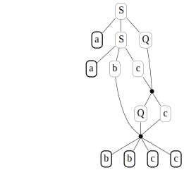

.. _examples:

Examples
========

To give a thorough example of what the library allows to implement, in
this `Jupyter <https://jupyter.org/>`__ session we follow rather
faitfully some Sections of `Parsing
Techniques <https://dickgrune.com//Books/PTAPG_2nd_Edition/>`__, an
eccellent book on parsing by Dick Grune and Ceriel J.H. Jacobs. We can
omit many details (such as defintions, proofs, careful algorithm
explanations…) but the interested reader can still find in such text a
very precise, clear and conceputal description of the ideas behind the
code implemented in the following examples.

Type 1 grammars and production graphs
-------------------------------------

Let’s start defining a *monotonic* grammar for :math:`a^nb^nc^n`

.. code:: ipython3

    from liblet import Grammar
    
    G = Grammar.from_string("""
    S -> a b c
    S -> a S Q
    b Q c -> b b c c
    c Q -> Q c
    """, False)
    
    G

.. parsed-literal::

    Grammar(N={Q, S}, T={a, b, c}, P=(S -> a b c, S -> a S Q, b Q c -> b b c c, c Q -> Q c), S=S)

It can be convenient to show the productions as a table, with numbered
rows.

.. code:: ipython3

    from liblet import iter2table
    
    iter2table(G.P)

.. raw:: html

    <table><tr><th>0<td style="text-align:left"><pre>S -> a b c</pre>
    <tr><th>1<td style="text-align:left"><pre>S -> a S Q</pre>
    <tr><th>2<td style="text-align:left"><pre>b Q c -> b b c c</pre>
    <tr><th>3<td style="text-align:left"><pre>c Q -> Q c</pre></table>

It’s now time to create a *derivation* of :math:`a^2b^2c^2`

.. code:: ipython3

    from liblet import Derivation
    
    d = Derivation(G).step(1, 0).step(0, 1).step(3, 3).step(2, 2)
    d

.. parsed-literal::

    S -> a S Q -> a a b c Q -> a a b Q c -> a a b b c c

It can be quite illuminating to see the *production graph* for such
derivation

.. code:: ipython3

    from liblet import ProductionGraph
    
    ProductionGraph(d)

Context-free grammars and ambiguity
-----------------------------------

Assume we want to experiment with an ambiguous grammar and look for two
different leftmost derivation of the same sentence.

To this aim, let’s consider the following grammar and a short derivation
leading to and addition of three terminals

.. code:: ipython3

    G = Grammar.from_string("""
    E -> E + E
    E -> E * E
    E -> i
    """)
    
    d = Derivation(G).step(0, 0).step(0, 0)
    d

.. parsed-literal::

    E -> E + E -> E + E + E

What are the possible steps at this point? The ``possible_steps`` method
comes in handy, here is a (numbered) table of pairs :math:`(p, q)` where
:math:`p` is production number and :math:`q` the position of the
nonterminal that can be substituted:

.. code:: ipython3

    possible_steps = list(d.possible_steps())
    iter2table(possible_steps)

.. raw:: html

    <table><tr><th>0<td style="text-align:left"><pre>(0, 0)</pre>
    <tr><th>1<td style="text-align:left"><pre>(0, 2)</pre>
    <tr><th>2<td style="text-align:left"><pre>(0, 4)</pre>
    <tr><th>3<td style="text-align:left"><pre>(1, 0)</pre>
    <tr><th>4<td style="text-align:left"><pre>(1, 2)</pre>
    <tr><th>5<td style="text-align:left"><pre>(1, 4)</pre>
    <tr><th>6<td style="text-align:left"><pre>(2, 0)</pre>
    <tr><th>7<td style="text-align:left"><pre>(2, 2)</pre>
    <tr><th>8<td style="text-align:left"><pre>(2, 4)</pre></table>

If we look for just for leftmost derivations among the
:math:`(p, q)`\ s, we must keep just the :math:`p`\ s corresponding to
the :math:`q`\ s equal to the minimum of the possible :math:`q` values.
The following function can be used to such aim:

.. code:: ipython3

    from operator import itemgetter
    
    def filter_leftmost_prods(possible_steps):
        possible_steps = list(possible_steps)
        if possible_steps:
            min_q = min(possible_steps, key = itemgetter(1))[1]
            return map(itemgetter(0), filter(lambda ps: ps[1] == min_q, possible_steps))
        return tuple()
    
    list(filter_leftmost_prods(possible_steps))

.. parsed-literal::

    [0, 1, 2]

Now, using a ``Queue`` we can enumerate all the leftmost productions, we
can have a fancy generator that returns a new derivation each time
``next`` is called on it:

.. code:: ipython3

    from liblet import Queue
    
    def derivation_generator(G):
        Q = Queue([Derivation(G)])
        while Q:
            derivation = Q.dequeue()
            if set(derivation.sentential_form()) <= G.T: 
                yield derivation
            for nprod in filter_leftmost_prods(derivation.possible_steps()):
                Q.enqueue(derivation.leftmost(nprod))

Let’s collect the first 10 derivations

.. code:: ipython3

    derivation = derivation_generator(G)
    D = [next(derivation) for _ in range(10)]
    iter2table(D)

.. raw:: html

    <table><tr><th>0<td style="text-align:left"><pre>E -> i</pre>
    <tr><th>1<td style="text-align:left"><pre>E -> E + E -> i + E -> i + i</pre>
    <tr><th>2<td style="text-align:left"><pre>E -> E * E -> i * E -> i * i</pre>
    <tr><th>3<td style="text-align:left"><pre>E -> E + E -> E + E + E -> i + E + E -> i + i + E -> i + i + i</pre>
    <tr><th>4<td style="text-align:left"><pre>E -> E + E -> E * E + E -> i * E + E -> i * i + E -> i * i + i</pre>
    <tr><th>5<td style="text-align:left"><pre>E -> E + E -> i + E -> i + E + E -> i + i + E -> i + i + i</pre>
    <tr><th>6<td style="text-align:left"><pre>E -> E + E -> i + E -> i + E * E -> i + i * E -> i + i * i</pre>
    <tr><th>7<td style="text-align:left"><pre>E -> E * E -> E + E * E -> i + E * E -> i + i * E -> i + i * i</pre>
    <tr><th>8<td style="text-align:left"><pre>E -> E * E -> E * E * E -> i * E * E -> i * i * E -> i * i * i</pre>
    <tr><th>9<td style="text-align:left"><pre>E -> E * E -> i * E -> i * E + E -> i * i + E -> i * i + i</pre></table>

As one can easily see, derivations 6 and 7 produce the same sentence
``i + i * i`` but evidently with two different leftmost derivations. We
can give a look at the production graphs to better see what is
happening.

.. code:: ipython3

    from liblet import side_by_side
    
    side_by_side(ProductionGraph(D[6]), ProductionGraph(D[7]))

.. raw:: html

    
<?xml version="1.0" encoding="UTF-8" standalone="no"?>
    <!DOCTYPE svg PUBLIC "-//W3C//DTD SVG 1.1//EN"
     "http://www.w3.org/Graphics/SVG/1.1/DTD/svg11.dtd">
    <!-- Generated by graphviz version 2.40.1 (20161225.0304)
     -->
    <!-- Title: %3 Pages: 1 -->
    <svg width="243pt" height="230pt"
     viewBox="0.00 0.00 243.03 230.00" xmlns="http://www.w3.org/2000/svg" xmlns:xlink="http://www.w3.org/1999/xlink">
    <g id="graph0" class="graph" transform="scale(1 1) rotate(0) translate(4 226)">
    <title>%3</title>
    <polygon fill="#ffffff" stroke="transparent" points="-4,4 -4,-226 239.0347,-226 239.0347,4 -4,4"/>
    <!-- 2274675410481489075 -->
    <!-- 821303785892311371 -->
    <!-- 2274675410481489075&#45;&gt;821303785892311371 -->
    <!-- 7111234759584721251 -->
    <g id="node2" class="node">
    <title>7111234759584721251</title>
    <path fill="none" stroke="#000000" stroke-width=".25" d="M157.4447,-222C157.4447,-222 152.0729,-222 152.0729,-222 149.387,-222 146.7011,-219.3141 146.7011,-216.6282 146.7011,-216.6282 146.7011,-205.3718 146.7011,-205.3718 146.7011,-202.6859 149.387,-200 152.0729,-200 152.0729,-200 157.4447,-200 157.4447,-200 160.1306,-200 162.8165,-202.6859 162.8165,-205.3718 162.8165,-205.3718 162.8165,-216.6282 162.8165,-216.6282 162.8165,-219.3141 160.1306,-222 157.4447,-222"/>
    <text text-anchor="middle" x="154.7588" y="-206.8" font-family="Times,serif" font-size="14.00" fill="#000000">E</text>
    </g>
    <!-- 7111236020781720074 -->
    <g id="node4" class="node">
    <title>7111236020781720074</title>
    <path fill="none" stroke="#000000" stroke-width=".25" d="M123.4447,-182C123.4447,-182 118.0729,-182 118.0729,-182 115.387,-182 112.7011,-179.3141 112.7011,-176.6282 112.7011,-176.6282 112.7011,-165.3718 112.7011,-165.3718 112.7011,-162.6859 115.387,-160 118.0729,-160 118.0729,-160 123.4447,-160 123.4447,-160 126.1306,-160 128.8165,-162.6859 128.8165,-165.3718 128.8165,-165.3718 128.8165,-176.6282 128.8165,-176.6282 128.8165,-179.3141 126.1306,-182 123.4447,-182"/>
    <text text-anchor="middle" x="120.7588" y="-166.8" font-family="Times,serif" font-size="14.00" fill="#000000">E</text>
    </g>
    <!-- 7111234759584721251&#45;&gt;7111236020781720074 -->
    <g id="edge2" class="edge">
    <title>7111234759584721251&#45;&gt;7111236020781720074</title>
    <path fill="none" stroke="#000000" stroke-width=".5" d="M146.5283,-201.3171C141.1827,-195.0281 134.2439,-186.8649 128.9134,-180.5937"/>
    </g>
    <!-- 6557964685501880825 -->
    <g id="node5" class="node">
    <title>6557964685501880825</title>
    <path fill="none" stroke="#000000" stroke-width="1.25" d="M157.3907,-182C157.3907,-182 152.1268,-182 152.1268,-182 149.4949,-182 146.8629,-179.3681 146.8629,-176.7361 146.8629,-176.7361 146.8629,-165.2639 146.8629,-165.2639 146.8629,-162.6319 149.4949,-160 152.1268,-160 152.1268,-160 157.3907,-160 157.3907,-160 160.0227,-160 162.6546,-162.6319 162.6546,-165.2639 162.6546,-165.2639 162.6546,-176.7361 162.6546,-176.7361 162.6546,-179.3681 160.0227,-182 157.3907,-182"/>
    <text text-anchor="middle" x="154.7588" y="-166.8" font-family="Times,serif" font-size="14.00" fill="#000000">+</text>
    </g>
    <!-- 7111234759584721251&#45;&gt;6557964685501880825 -->
    <g id="edge3" class="edge">
    <title>7111234759584721251&#45;&gt;6557964685501880825</title>
    <path fill="none" stroke="#000000" stroke-width=".5" d="M154.7588,-199.6446C154.7588,-194.1937 154.7588,-187.6819 154.7588,-182.2453"/>
    </g>
    <!-- 7111236020779389976 -->
    <g id="node6" class="node">
    <title>7111236020779389976</title>
    <path fill="none" stroke="#000000" stroke-width=".25" d="M191.4447,-182C191.4447,-182 186.0729,-182 186.0729,-182 183.387,-182 180.7011,-179.3141 180.7011,-176.6282 180.7011,-176.6282 180.7011,-165.3718 180.7011,-165.3718 180.7011,-162.6859 183.387,-160 186.0729,-160 186.0729,-160 191.4447,-160 191.4447,-160 194.1306,-160 196.8165,-162.6859 196.8165,-165.3718 196.8165,-165.3718 196.8165,-176.6282 196.8165,-176.6282 196.8165,-179.3141 194.1306,-182 191.4447,-182"/>
    <text text-anchor="middle" x="188.7588" y="-166.8" font-family="Times,serif" font-size="14.00" fill="#000000">E</text>
    </g>
    <!-- 7111234759584721251&#45;&gt;7111236020779389976 -->
    <g id="edge4" class="edge">
    <title>7111234759584721251&#45;&gt;7111236020779389976</title>
    <path fill="none" stroke="#000000" stroke-width=".5" d="M162.9892,-201.3171C168.3349,-195.0281 175.2736,-186.8649 180.6041,-180.5937"/>
    </g>
    <!-- &#45;5669898871303867245 -->
    <!-- 821303785892311371&#45;&gt;&#45;5669898871303867245 -->
    <!-- 7111236020781720074&#45;&gt;6557964685501880825 -->
    <!-- 8867683497153756775 -->
    <g id="node8" class="node">
    <title>8867683497153756775</title>
    <path fill="none" stroke="#000000" stroke-width="1.25" d="M120.7222,-142C120.7222,-142 116.7954,-142 116.7954,-142 114.832,-142 112.8686,-140.0366 112.8686,-138.0732 112.8686,-138.0732 112.8686,-123.9268 112.8686,-123.9268 112.8686,-121.9634 114.832,-120 116.7954,-120 116.7954,-120 120.7222,-120 120.7222,-120 122.6856,-120 124.6489,-121.9634 124.6489,-123.9268 124.6489,-123.9268 124.6489,-138.0732 124.6489,-138.0732 124.6489,-140.0366 122.6856,-142 120.7222,-142"/>
    <text text-anchor="middle" x="118.7588" y="-126.8" font-family="Times,serif" font-size="14.00" fill="#000000">i</text>
    </g>
    <!-- 7111236020781720074&#45;&gt;8867683497153756775 -->
    <g id="edge8" class="edge">
    <title>7111236020781720074&#45;&gt;8867683497153756775</title>
    <path fill="none" stroke="#000000" stroke-width=".5" d="M120.191,-159.6446C119.9185,-154.1937 119.5929,-147.6819 119.3211,-142.2453"/>
    </g>
    <!-- 6557964685501880825&#45;&gt;7111236020779389976 -->
    <!-- 7111238543175717720 -->
    <g id="node10" class="node">
    <title>7111238543175717720</title>
    <path fill="none" stroke="#000000" stroke-width=".25" d="M157.4447,-102C157.4447,-102 152.0729,-102 152.0729,-102 149.387,-102 146.7011,-99.3141 146.7011,-96.6282 146.7011,-96.6282 146.7011,-85.3718 146.7011,-85.3718 146.7011,-82.6859 149.387,-80 152.0729,-80 152.0729,-80 157.4447,-80 157.4447,-80 160.1306,-80 162.8165,-82.6859 162.8165,-85.3718 162.8165,-85.3718 162.8165,-96.6282 162.8165,-96.6282 162.8165,-99.3141 160.1306,-102 157.4447,-102"/>
    <text text-anchor="middle" x="154.7588" y="-86.8" font-family="Times,serif" font-size="14.00" fill="#000000">E</text>
    </g>
    <!-- 7111236020779389976&#45;&gt;7111238543175717720 -->
    <g id="edge10" class="edge">
    <title>7111236020779389976&#45;&gt;7111238543175717720</title>
    <path fill="none" stroke="#000000" stroke-width=".5" d="M184.0312,-159.8763C177.5354,-144.5921 165.9208,-117.2636 159.4462,-102.0292"/>
    </g>
    <!-- 2562199939969962954 -->
    <g id="node11" class="node">
    <title>2562199939969962954</title>
    <path fill="none" stroke="#000000" stroke-width="1.25" d="M193.2588,-102C193.2588,-102 188.2588,-102 188.2588,-102 185.7588,-102 183.2588,-99.5 183.2588,-97 183.2588,-97 183.2588,-85 183.2588,-85 183.2588,-82.5 185.7588,-80 188.2588,-80 188.2588,-80 193.2588,-80 193.2588,-80 195.7588,-80 198.2588,-82.5 198.2588,-85 198.2588,-85 198.2588,-97 198.2588,-97 198.2588,-99.5 195.7588,-102 193.2588,-102"/>
    <text text-anchor="middle" x="190.7588" y="-86.8" font-family="Times,serif" font-size="14.00" fill="#000000">*</text>
    </g>
    <!-- 7111236020779389976&#45;&gt;2562199939969962954 -->
    <g id="edge11" class="edge">
    <title>7111236020779389976&#45;&gt;2562199939969962954</title>
    <path fill="none" stroke="#000000" stroke-width=".5" d="M189.0369,-159.8763C189.419,-144.5921 190.1022,-117.2636 190.4831,-102.0292"/>
    </g>
    <!-- 7111238543178047818 -->
    <g id="node12" class="node">
    <title>7111238543178047818</title>
    <path fill="none" stroke="#000000" stroke-width=".25" d="M229.4447,-102C229.4447,-102 224.0729,-102 224.0729,-102 221.387,-102 218.7011,-99.3141 218.7011,-96.6282 218.7011,-96.6282 218.7011,-85.3718 218.7011,-85.3718 218.7011,-82.6859 221.387,-80 224.0729,-80 224.0729,-80 229.4447,-80 229.4447,-80 232.1306,-80 234.8165,-82.6859 234.8165,-85.3718 234.8165,-85.3718 234.8165,-96.6282 234.8165,-96.6282 234.8165,-99.3141 232.1306,-102 229.4447,-102"/>
    <text text-anchor="middle" x="226.7588" y="-86.8" font-family="Times,serif" font-size="14.00" fill="#000000">E</text>
    </g>
    <!-- 7111236020779389976&#45;&gt;7111238543178047818 -->
    <g id="edge12" class="edge">
    <title>7111236020779389976&#45;&gt;7111238543178047818</title>
    <path fill="none" stroke="#000000" stroke-width=".5" d="M194.7416,-159.7778C197.5475,-154.4285 200.8958,-147.9192 203.7588,-142 210.3564,-128.3596 217.4539,-112.4052 221.9922,-102.0222"/>
    </g>
    <!-- 7561231962254181255 -->
    <!-- &#45;5669898871303867245&#45;&gt;7561231962254181255 -->
    <!-- 8367579817054949371 -->
    <!-- 7561231962254181255&#45;&gt;8367579817054949371 -->
    <!-- 7111238543175717720&#45;&gt;2562199939969962954 -->
    <!-- 8867680974759759129 -->
    <g id="node14" class="node">
    <title>8867680974759759129</title>
    <path fill="none" stroke="#000000" stroke-width="1.25" d="M156.7222,-62C156.7222,-62 152.7954,-62 152.7954,-62 150.832,-62 148.8686,-60.0366 148.8686,-58.0732 148.8686,-58.0732 148.8686,-43.9268 148.8686,-43.9268 148.8686,-41.9634 150.832,-40 152.7954,-40 152.7954,-40 156.7222,-40 156.7222,-40 158.6856,-40 160.6489,-41.9634 160.6489,-43.9268 160.6489,-43.9268 160.6489,-58.0732 160.6489,-58.0732 160.6489,-60.0366 158.6856,-62 156.7222,-62"/>
    <text text-anchor="middle" x="154.7588" y="-46.8" font-family="Times,serif" font-size="14.00" fill="#000000">i</text>
    </g>
    <!-- 7111238543175717720&#45;&gt;8867680974759759129 -->
    <g id="edge16" class="edge">
    <title>7111238543175717720&#45;&gt;8867680974759759129</title>
    <path fill="none" stroke="#000000" stroke-width=".5" d="M154.7588,-79.6446C154.7588,-74.1937 154.7588,-67.6819 154.7588,-62.2453"/>
    </g>
    <!-- 2562199939969962954&#45;&gt;7111238543178047818 -->
    <!-- 8867682235956757952 -->
    <g id="node16" class="node">
    <title>8867682235956757952</title>
    <path fill="none" stroke="#000000" stroke-width="1.25" d="M228.7222,-22C228.7222,-22 224.7954,-22 224.7954,-22 222.832,-22 220.8686,-20.0366 220.8686,-18.0732 220.8686,-18.0732 220.8686,-3.9268 220.8686,-3.9268 220.8686,-1.9634 222.832,0 224.7954,0 224.7954,0 228.7222,0 228.7222,0 230.6856,0 232.6489,-1.9634 232.6489,-3.9268 232.6489,-3.9268 232.6489,-18.0732 232.6489,-18.0732 232.6489,-20.0366 230.6856,-22 228.7222,-22"/>
    <text text-anchor="middle" x="226.7588" y="-6.8" font-family="Times,serif" font-size="14.00" fill="#000000">i</text>
    </g>
    <!-- 7111238543178047818&#45;&gt;8867682235956757952 -->
    <g id="edge18" class="edge">
    <title>7111238543178047818&#45;&gt;8867682235956757952</title>
    <path fill="none" stroke="#000000" stroke-width=".5" d="M226.7588,-79.8763C226.7588,-64.5921 226.7588,-37.2636 226.7588,-22.0292"/>
    </g>
    <!-- 7561131039434899913 -->
    <!-- 8367579817054949371&#45;&gt;7561131039434899913 -->
    </g>
    </svg>
     <?xml version="1.0" encoding="UTF-8" standalone="no"?>
    <!DOCTYPE svg PUBLIC "-//W3C//DTD SVG 1.1//EN"
     "http://www.w3.org/Graphics/SVG/1.1/DTD/svg11.dtd">
    <!-- Generated by graphviz version 2.40.1 (20161225.0304)
     -->
    <!-- Title: %3 Pages: 1 -->
    <svg width="239pt" height="230pt"
     viewBox="0.00 0.00 239.03 230.00" xmlns="http://www.w3.org/2000/svg" xmlns:xlink="http://www.w3.org/1999/xlink">
    <g id="graph0" class="graph" transform="scale(1 1) rotate(0) translate(4 226)">
    <title>%3</title>
    <polygon fill="#ffffff" stroke="transparent" points="-4,4 -4,-226 235.0347,-226 235.0347,4 -4,4"/>
    <!-- 2274675410481489075 -->
    <!-- 821303785892311371 -->
    <!-- 2274675410481489075&#45;&gt;821303785892311371 -->
    <!-- 7111234759584721251 -->
    <g id="node2" class="node">
    <title>7111234759584721251</title>
    <path fill="none" stroke="#000000" stroke-width=".25" d="M191.4447,-222C191.4447,-222 186.0729,-222 186.0729,-222 183.387,-222 180.7011,-219.3141 180.7011,-216.6282 180.7011,-216.6282 180.7011,-205.3718 180.7011,-205.3718 180.7011,-202.6859 183.387,-200 186.0729,-200 186.0729,-200 191.4447,-200 191.4447,-200 194.1306,-200 196.8165,-202.6859 196.8165,-205.3718 196.8165,-205.3718 196.8165,-216.6282 196.8165,-216.6282 196.8165,-219.3141 194.1306,-222 191.4447,-222"/>
    <text text-anchor="middle" x="188.7588" y="-206.8" font-family="Times,serif" font-size="14.00" fill="#000000">E</text>
    </g>
    <!-- 7111236020781720074 -->
    <g id="node4" class="node">
    <title>7111236020781720074</title>
    <path fill="none" stroke="#000000" stroke-width=".25" d="M157.4447,-182C157.4447,-182 152.0729,-182 152.0729,-182 149.387,-182 146.7011,-179.3141 146.7011,-176.6282 146.7011,-176.6282 146.7011,-165.3718 146.7011,-165.3718 146.7011,-162.6859 149.387,-160 152.0729,-160 152.0729,-160 157.4447,-160 157.4447,-160 160.1306,-160 162.8165,-162.6859 162.8165,-165.3718 162.8165,-165.3718 162.8165,-176.6282 162.8165,-176.6282 162.8165,-179.3141 160.1306,-182 157.4447,-182"/>
    <text text-anchor="middle" x="154.7588" y="-166.8" font-family="Times,serif" font-size="14.00" fill="#000000">E</text>
    </g>
    <!-- 7111234759584721251&#45;&gt;7111236020781720074 -->
    <g id="edge2" class="edge">
    <title>7111234759584721251&#45;&gt;7111236020781720074</title>
    <path fill="none" stroke="#000000" stroke-width=".5" d="M180.5283,-201.3171C175.1827,-195.0281 168.2439,-186.8649 162.9134,-180.5937"/>
    </g>
    <!-- 2562197417575965308 -->
    <g id="node5" class="node">
    <title>2562197417575965308</title>
    <path fill="none" stroke="#000000" stroke-width="1.25" d="M191.2588,-182C191.2588,-182 186.2588,-182 186.2588,-182 183.7588,-182 181.2588,-179.5 181.2588,-177 181.2588,-177 181.2588,-165 181.2588,-165 181.2588,-162.5 183.7588,-160 186.2588,-160 186.2588,-160 191.2588,-160 191.2588,-160 193.7588,-160 196.2588,-162.5 196.2588,-165 196.2588,-165 196.2588,-177 196.2588,-177 196.2588,-179.5 193.7588,-182 191.2588,-182"/>
    <text text-anchor="middle" x="188.7588" y="-166.8" font-family="Times,serif" font-size="14.00" fill="#000000">*</text>
    </g>
    <!-- 7111234759584721251&#45;&gt;2562197417575965308 -->
    <g id="edge3" class="edge">
    <title>7111234759584721251&#45;&gt;2562197417575965308</title>
    <path fill="none" stroke="#000000" stroke-width=".5" d="M188.7588,-199.6446C188.7588,-194.1937 188.7588,-187.6819 188.7588,-182.2453"/>
    </g>
    <!-- 7111236020779389976 -->
    <g id="node6" class="node">
    <title>7111236020779389976</title>
    <path fill="none" stroke="#000000" stroke-width=".25" d="M225.4447,-182C225.4447,-182 220.0729,-182 220.0729,-182 217.387,-182 214.7011,-179.3141 214.7011,-176.6282 214.7011,-176.6282 214.7011,-165.3718 214.7011,-165.3718 214.7011,-162.6859 217.387,-160 220.0729,-160 220.0729,-160 225.4447,-160 225.4447,-160 228.1306,-160 230.8165,-162.6859 230.8165,-165.3718 230.8165,-165.3718 230.8165,-176.6282 230.8165,-176.6282 230.8165,-179.3141 228.1306,-182 225.4447,-182"/>
    <text text-anchor="middle" x="222.7588" y="-166.8" font-family="Times,serif" font-size="14.00" fill="#000000">E</text>
    </g>
    <!-- 7111234759584721251&#45;&gt;7111236020779389976 -->
    <g id="edge4" class="edge">
    <title>7111234759584721251&#45;&gt;7111236020779389976</title>
    <path fill="none" stroke="#000000" stroke-width=".5" d="M196.9892,-201.3171C202.3349,-195.0281 209.2736,-186.8649 214.6041,-180.5937"/>
    </g>
    <!-- &#45;5669898871303867245 -->
    <!-- 821303785892311371&#45;&gt;&#45;5669898871303867245 -->
    <!-- 7111236020781720074&#45;&gt;2562197417575965308 -->
    <!-- 7111237281978718897 -->
    <g id="node8" class="node">
    <title>7111237281978718897</title>
    <path fill="none" stroke="#000000" stroke-width=".25" d="M122.4447,-142C122.4447,-142 117.0729,-142 117.0729,-142 114.387,-142 111.7011,-139.3141 111.7011,-136.6282 111.7011,-136.6282 111.7011,-125.3718 111.7011,-125.3718 111.7011,-122.6859 114.387,-120 117.0729,-120 117.0729,-120 122.4447,-120 122.4447,-120 125.1306,-120 127.8165,-122.6859 127.8165,-125.3718 127.8165,-125.3718 127.8165,-136.6282 127.8165,-136.6282 127.8165,-139.3141 125.1306,-142 122.4447,-142"/>
    <text text-anchor="middle" x="119.7588" y="-126.8" font-family="Times,serif" font-size="14.00" fill="#000000">E</text>
    </g>
    <!-- 7111236020781720074&#45;&gt;7111237281978718897 -->
    <g id="edge8" class="edge">
    <title>7111236020781720074&#45;&gt;7111237281978718897</title>
    <path fill="none" stroke="#000000" stroke-width=".5" d="M146.6411,-161.7227C140.9868,-155.2606 133.4771,-146.6781 127.8324,-140.227"/>
    </g>
    <!-- 6557965946701209746 -->
    <g id="node9" class="node">
    <title>6557965946701209746</title>
    <path fill="none" stroke="#000000" stroke-width="1.25" d="M156.3907,-142C156.3907,-142 151.1268,-142 151.1268,-142 148.4949,-142 145.8629,-139.3681 145.8629,-136.7361 145.8629,-136.7361 145.8629,-125.2639 145.8629,-125.2639 145.8629,-122.6319 148.4949,-120 151.1268,-120 151.1268,-120 156.3907,-120 156.3907,-120 159.0227,-120 161.6546,-122.6319 161.6546,-125.2639 161.6546,-125.2639 161.6546,-136.7361 161.6546,-136.7361 161.6546,-139.3681 159.0227,-142 156.3907,-142"/>
    <text text-anchor="middle" x="153.7588" y="-126.8" font-family="Times,serif" font-size="14.00" fill="#000000">+</text>
    </g>
    <!-- 7111236020781720074&#45;&gt;6557965946701209746 -->
    <g id="edge9" class="edge">
    <title>7111236020781720074&#45;&gt;6557965946701209746</title>
    <path fill="none" stroke="#000000" stroke-width=".5" d="M154.4749,-159.6446C154.3386,-154.1937 154.1758,-147.6819 154.0399,-142.2453"/>
    </g>
    <!-- 7111237281976388799 -->
    <g id="node10" class="node">
    <title>7111237281976388799</title>
    <path fill="none" stroke="#000000" stroke-width=".25" d="M190.4447,-142C190.4447,-142 185.0729,-142 185.0729,-142 182.387,-142 179.7011,-139.3141 179.7011,-136.6282 179.7011,-136.6282 179.7011,-125.3718 179.7011,-125.3718 179.7011,-122.6859 182.387,-120 185.0729,-120 185.0729,-120 190.4447,-120 190.4447,-120 193.1306,-120 195.8165,-122.6859 195.8165,-125.3718 195.8165,-125.3718 195.8165,-136.6282 195.8165,-136.6282 195.8165,-139.3141 193.1306,-142 190.4447,-142"/>
    <text text-anchor="middle" x="187.7588" y="-126.8" font-family="Times,serif" font-size="14.00" fill="#000000">E</text>
    </g>
    <!-- 7111236020781720074&#45;&gt;7111237281976388799 -->
    <g id="edge10" class="edge">
    <title>7111236020781720074&#45;&gt;7111237281976388799</title>
    <path fill="none" stroke="#000000" stroke-width=".5" d="M163.0861,-160.9063C168.1268,-154.7963 174.529,-147.0361 179.5485,-140.9519"/>
    </g>
    <!-- 2562197417575965308&#45;&gt;7111236020779389976 -->
    <!-- 8867682235956757952 -->
    <g id="node16" class="node">
    <title>8867682235956757952</title>
    <path fill="none" stroke="#000000" stroke-width="1.25" d="M226.7222,-22C226.7222,-22 222.7954,-22 222.7954,-22 220.832,-22 218.8686,-20.0366 218.8686,-18.0732 218.8686,-18.0732 218.8686,-3.9268 218.8686,-3.9268 218.8686,-1.9634 220.832,0 222.7954,0 222.7954,0 226.7222,0 226.7222,0 228.6856,0 230.6489,-1.9634 230.6489,-3.9268 230.6489,-3.9268 230.6489,-18.0732 230.6489,-18.0732 230.6489,-20.0366 228.6856,-22 226.7222,-22"/>
    <text text-anchor="middle" x="224.7588" y="-6.8" font-family="Times,serif" font-size="14.00" fill="#000000">i</text>
    </g>
    <!-- 7111236020779389976&#45;&gt;8867682235956757952 -->
    <g id="edge18" class="edge">
    <title>7111236020779389976&#45;&gt;8867682235956757952</title>
    <path fill="none" stroke="#000000" stroke-width=".5" d="M222.8994,-159.7491C223.2675,-130.3006 224.256,-51.2201 224.621,-22.026"/>
    </g>
    <!-- 7561231962254181255 -->
    <!-- &#45;5669898871303867245&#45;&gt;7561231962254181255 -->
    <!-- 7111237281978718897&#45;&gt;6557965946701209746 -->
    <!-- 8867684758350755598 -->
    <g id="node12" class="node">
    <title>8867684758350755598</title>
    <path fill="none" stroke="#000000" stroke-width="1.25" d="M121.7222,-102C121.7222,-102 117.7954,-102 117.7954,-102 115.832,-102 113.8686,-100.0366 113.8686,-98.0732 113.8686,-98.0732 113.8686,-83.9268 113.8686,-83.9268 113.8686,-81.9634 115.832,-80 117.7954,-80 117.7954,-80 121.7222,-80 121.7222,-80 123.6856,-80 125.6489,-81.9634 125.6489,-83.9268 125.6489,-83.9268 125.6489,-98.0732 125.6489,-98.0732 125.6489,-100.0366 123.6856,-102 121.7222,-102"/>
    <text text-anchor="middle" x="119.7588" y="-86.8" font-family="Times,serif" font-size="14.00" fill="#000000">i</text>
    </g>
    <!-- 7111237281978718897&#45;&gt;8867684758350755598 -->
    <g id="edge14" class="edge">
    <title>7111237281978718897&#45;&gt;8867684758350755598</title>
    <path fill="none" stroke="#000000" stroke-width=".5" d="M119.7588,-119.6446C119.7588,-114.1937 119.7588,-107.6819 119.7588,-102.2453"/>
    </g>
    <!-- 6557965946701209746&#45;&gt;7111237281976388799 -->
    <!-- 8867680974759759129 -->
    <g id="node14" class="node">
    <title>8867680974759759129</title>
    <path fill="none" stroke="#000000" stroke-width="1.25" d="M188.7222,-62C188.7222,-62 184.7954,-62 184.7954,-62 182.832,-62 180.8686,-60.0366 180.8686,-58.0732 180.8686,-58.0732 180.8686,-43.9268 180.8686,-43.9268 180.8686,-41.9634 182.832,-40 184.7954,-40 184.7954,-40 188.7222,-40 188.7222,-40 190.6856,-40 192.6489,-41.9634 192.6489,-43.9268 192.6489,-43.9268 192.6489,-58.0732 192.6489,-58.0732 192.6489,-60.0366 190.6856,-62 188.7222,-62"/>
    <text text-anchor="middle" x="186.7588" y="-46.8" font-family="Times,serif" font-size="14.00" fill="#000000">i</text>
    </g>
    <!-- 7111237281976388799&#45;&gt;8867680974759759129 -->
    <g id="edge16" class="edge">
    <title>7111237281976388799&#45;&gt;8867680974759759129</title>
    <path fill="none" stroke="#000000" stroke-width=".5" d="M187.6197,-119.8763C187.4287,-104.5921 187.0871,-77.2636 186.8967,-62.0292"/>
    </g>
    <!-- 8367579817054949371 -->
    <!-- 7561231962254181255&#45;&gt;8367579817054949371 -->
    <!-- 7561131039434899913 -->
    <!-- 8367579817054949371&#45;&gt;7561131039434899913 -->
    </g>
    </svg>
    

Hygiene in Context-Free Grammars
--------------------------------

First of all, let’s start with a series of techniques to clean a
*context-free* grammar by removing *unreachable*, *non-productive*, and
*undefined* symbols. Let’s start with the *context-free* grammar
:math:`G` of Figure 2.25 at page 49 of `Parsing
Techniques <https://dickgrune.com//Books/PTAPG_2nd_Edition/>`__, in
particular we’ll be following the flow of Sections 2.9.1, 2.9.2 and
2.9.5.

.. code:: ipython3

    G = Grammar.from_string("""
    S -> A B | D E
    A -> a
    B -> b C
    C -> c
    D -> d F 
    E -> e 
    F -> f D
    """)

We can use the ``@closure`` decorator to obtain the *productive* symbols
by extending at every round the set ``prod`` of productive symbols as
``{A for A, α in G.P if set(α) <= prod}``, that is taking all the
*lefthand* sides of productions whose *righthand* sides are in turn made
of productive symbols.

.. code:: ipython3

    from liblet import closure
    
    def find_productive(G):
        @closure
        def find(prod):
            return prod | {A for A, α in G.P if set(α) <= prod}
        return set(find(G.T))

.. code:: ipython3

    find_productive(G)

.. parsed-literal::

    {'A', 'B', 'C', 'E', 'S', 'a', 'b', 'c', 'd', 'e', 'f'}

Similarly, we can obtain the *reachable* symbols by extending at every
round the set ``reach`` of reachable symbols as
``union_of(set(α) for A, α in G.P if A in reach)}``, that is taking the
union all the *righthand* sides of productions whose *lefthand* sides
are in turn reachable.

.. code:: ipython3

    from liblet import union_of
    
    def find_reachable(G):
        @closure
        def find(reach, G):
            return reach | union_of(set(α) for A, α in G.P if A in reach)
        return find({G.S}, G)   

.. code:: ipython3

    find_reachable(G)

.. parsed-literal::

    {'A', 'B', 'C', 'D', 'E', 'F', 'S', 'a', 'b', 'c', 'd', 'e', 'f'}

To clean the grammar one has first to eliminate the non-productive
symbols and the the non-reachable onse (as acting in the reverse order
can leave around non-reachable symbols after the first removal).

.. code:: ipython3

    def remove_unproductive_unreachable(G):
        Gp = G.restrict_to(find_productive(G))
        return Gp.restrict_to(find_reachable(Gp))

.. code:: ipython3

    remove_unproductive_unreachable(G)

.. parsed-literal::

    Grammar(N={A, B, C, S}, T={a, b, c}, P=(S -> A B, A -> a, B -> b C, C -> c), S=S)

To remove *undefined* nonterminals is easy, it’s enough to collect the
ones appearing as *lefthand* side in some production and throw away the
others

.. code:: ipython3

    def remove_undefined(G):
        return G.restrict_to({A for A, α in G.P} | G.T)

Given that ``Grammar.from_string`` considers nonterminal just the
symbols on the *lefthand* sides, to check that the last method works we
need to build a grammar in another way:

.. code:: ipython3

    from liblet import Production
    
    Gu = Grammar({'S', 'T'}, {'s'}, (Production('S', ('s',)),), 'S')
    Gu

.. parsed-literal::

    Grammar(N={S, T}, T={s}, P=(S -> s,), S=S)

.. code:: ipython3

    remove_undefined(Gu)

.. parsed-literal::

    Grammar(N={S}, T={s}, P=(S -> s,), S=S)

Observe that undefined symbols are non-productive, hence
``remove_unproductive_unreachable`` will take implicitly care of them.

The Chomsky Normal Form
-----------------------

Now that the grammar contains only defined, productive and reachable
symbols, to get to the CHomsky normal form we need to take care of
ε-rules and unit rules (following Section 4.2.3 of `Parsing
Techniques <https://dickgrune.com//Books/PTAPG_2nd_Edition/>`__).

Elimination of ε-rules
~~~~~~~~~~~~~~~~~~~~~~

The elimination of ε-rules is performed in a series of consecutive
steps, adding new nonterminals and productions.

As an example grammar we use the one of Figure 4.10 at page 120.

.. code:: ipython3

    G = Grammar.from_string("""
    S -> L a M
    L -> L M 
    L -> ε
    M -> M M
    M -> ε
    """)

Given a rule :math:`A\to ε` we look for rules of the form
:math:`B\to αAβ` and “inline” the ε-rule by adding two new rules
:math:`B\to αA'β` and :math:`B\to αβ` where :math:`A'` is a new
nonterminal; this of course need to be iterated (in a closure) to cope
with productions where :math:`A` appears more than once in the
*righthand* side.

.. code:: ipython3

    @closure
    def replace_in_rhs(G, A):
        Ap = A + '’'
        prods = set()
        for B, β in G.P:
            if A in β:
                pos = β.index(A)
                rhs = β[:pos] + β[pos + 1:]
                if len(rhs) == 0: rhs = ('ε', )
                prods.add(Production(B, rhs))
                prods.add(Production(B, β[:pos] + (Ap, ) + β[pos + 1:]))
            else:
                prods.add(Production(B, β))    
        return Grammar(G.N | {Ap}, G.T, prods, G.S)

.. code:: ipython3

    from liblet import prods2table
    
    Gp = replace_in_rhs(G, 'M')
    prods2table(Gp)

.. raw:: html

    <table><tr><th>S<td style="text-align:left">L a | L a M’<tr><th>L<td style="text-align:left">L | L M’ | ε<tr><th>M<td style="text-align:left">M’ | M’ M’ | ε<tr><th>M’<td style="text-align:left"></table>

The above procedure must be repeated for evey ε-rule, moreover since the
process can intruduce new ε-rules, a closure is again needed.

.. code:: ipython3

    @closure
    def inline_ε_rules(G_seen):
        G, seen = G_seen
        for A in G.N - seen:
            if ('ε', ) in G.alternatives(A):
                return replace_in_rhs(G, A), seen | {A}
        return G, seen

.. code:: ipython3

    Gp, _ = inline_ε_rules((G, set()))
    prods2table(Gp)

.. raw:: html

    <table><tr><th>S<td style="text-align:left">L’ a | L’ a M’ | a | a M’<tr><th>L<td style="text-align:left">L’ | L’ M’ | M’ | ε<tr><th>L’<td style="text-align:left"><tr><th>M<td style="text-align:left">M’ | M’ M’ | ε<tr><th>M’<td style="text-align:left"></table>

The *lefthand* sides of the ε rules now are unreachable, but the new
“primed” nonterminals must now be defined, using the non-empty
*righthand* sides of the one they inlined.

.. code:: ipython3

    def eliminate_ε_rules(G):
        Gp, _ = inline_ε_rules((G, set()))
        prods = set(Gp.P)
        for Ap in Gp.N - G.N:
            A = Ap[:-1]
            for α in set(Gp.alternatives(A)) - {('ε', )}:
                prods.add(Production(Ap, α))
        return Grammar(Gp.N, Gp.T, prods, Gp.S)

.. code:: ipython3

    prods2table(eliminate_ε_rules(G))

.. raw:: html

    <table><tr><th>S<td style="text-align:left">L’ a | L’ a M’ | a | a M’<tr><th>L<td style="text-align:left">L’ | L’ M’ | M’ | ε<tr><th>L’<td style="text-align:left">L’ | L’ M’ | M’<tr><th>M<td style="text-align:left">M’ | M’ M’ | ε<tr><th>M’<td style="text-align:left">M’ | M’ M’</table>

Removing the unreachable and non-productive rules leads to quite a
drastic simplification!

.. code:: ipython3

    remove_unproductive_unreachable(eliminate_ε_rules(G))

.. parsed-literal::

    Grammar(N={S}, T={a}, P=(S -> a,), S=S)

Elimination of unit rules
~~~~~~~~~~~~~~~~~~~~~~~~~

To see what happens dealing with rules of the form :math:`A\to B` we’ll
refer to a more complex grammar, the one of Figure 4.6 at page 112.

.. code:: ipython3

    G = Grammar.from_string("""
    Number -> Integer | Real
    Integer -> Digit | Integer Digit
    Real -> Integer Fraction Scale
    Fraction -> . Integer
    Scale -> e Sign Integer | Empty
    Digit -> 0 | 1 | 2 | 3 | 4 | 5 | 6 | 7 | 8 | 9
    Sign -> + | -
    Empty -> ε
    """)
    prods2table(G)

.. raw:: html

    <table><tr><th>Number<td style="text-align:left">Integer | Real<tr><th>Digit<td style="text-align:left">0 | 1 | 2 | 3 | 4 | 5 | 6 | 7 | 8 | 9<tr><th>Empty<td style="text-align:left">ε<tr><th>Fraction<td style="text-align:left">. Integer<tr><th>Integer<td style="text-align:left">Digit | Integer Digit<tr><th>Real<td style="text-align:left">Integer Fraction Scale<tr><th>Scale<td style="text-align:left">Empty | e Sign Integer<tr><th>Sign<td style="text-align:left">+ | -</table>

We start by applying all the cleaning steps seen so far.

.. code:: ipython3

    Gorig = G
    G = remove_unproductive_unreachable(eliminate_ε_rules(G))
    prods2table(G)

.. raw:: html

    <table><tr><th>Number<td style="text-align:left">Integer | Real<tr><th>Digit<td style="text-align:left">0 | 1 | 2 | 3 | 4 | 5 | 6 | 7 | 8 | 9<tr><th>Fraction<td style="text-align:left">. Integer<tr><th>Integer<td style="text-align:left">Digit | Integer Digit<tr><th>Real<td style="text-align:left">Integer Fraction | Integer Fraction Scale’<tr><th>Scale’<td style="text-align:left">e Sign Integer<tr><th>Sign<td style="text-align:left">+ | -</table>

The elimination of the unit rules is based again on a closure that
replaces :math:`A\to B` and :math:`B\to α` with :math:`A\to α`.

.. code:: ipython3

    def eliminate_unit_rules(G):
        @closure
        def clean(G_seen):
            G, seen = G_seen
            for P in set(filter(Production.such_that(rhs_len = 1), G.P)) - seen:
                A, (B, ) = P
                if B in G.N:            
                    prods = (set(G.P) | {Production(A, α) for α in G.alternatives(B)}) - {P}
                    return Grammar(G.N, G.T, prods, G.S), seen | {P}
            return G, seen
        return clean((G, set()))[0]

.. code:: ipython3

    G = eliminate_unit_rules(G)
    prods2table(G)

.. raw:: html

    <table><tr><th>Number<td style="text-align:left">0 | 1 | 2 | 3 | 4 | 5 | 6 | 7 | 8 | 9 | Integer Digit | Integer Fraction | Integer Fraction Scale’<tr><th>Digit<td style="text-align:left">0 | 1 | 2 | 3 | 4 | 5 | 6 | 7 | 8 | 9<tr><th>Fraction<td style="text-align:left">. Integer<tr><th>Integer<td style="text-align:left">0 | 1 | 2 | 3 | 4 | 5 | 6 | 7 | 8 | 9 | Integer Digit<tr><th>Real<td style="text-align:left">Integer Fraction | Integer Fraction Scale’<tr><th>Scale’<td style="text-align:left">e Sign Integer<tr><th>Sign<td style="text-align:left">+ | -</table>

The normal form
~~~~~~~~~~~~~~~

Two last cases need to be taken care of to get to the CNF.

First we want to eliminate non-solitary terminals in *lefthand* sides,
that is if :math:`A\to αaβ` where :math:`a\in T` and
:math:`α, β\in N^*`; this is easily solved by introducing a new
nonterminal :math:`N_a` and a new rule :math:`N_a\to a`, replacing the
offending :math:`A\to αaβ` with :math:`A\to αN_aβ`.

.. code:: ipython3

    def transform_nonsolitary(G):
        prods = set()
        for A, α in G.P:
            if len(α) > 1 and set(α) & G.T:
                rhs = []
                for x in α:
                    if x in G.T:
                        N = 'N{}'.format(x)
                        prods.add(Production(N, (x, )))
                        rhs.append(N)
                    else:
                        rhs.append(x)
                prods.add(Production(A, rhs))
            else:            
                prods.add(Production(A, α))
        return Grammar(G.N | {A for A, α in prods}, G.T, prods, G.S)

.. code:: ipython3

    G = transform_nonsolitary(G)
    prods2table(G)

.. raw:: html

    <table><tr><th>Number<td style="text-align:left">0 | 1 | 2 | 3 | 4 | 5 | 6 | 7 | 8 | 9 | Integer Digit | Integer Fraction | Integer Fraction Scale’<tr><th>Digit<td style="text-align:left">0 | 1 | 2 | 3 | 4 | 5 | 6 | 7 | 8 | 9<tr><th>Fraction<td style="text-align:left">N. Integer<tr><th>Integer<td style="text-align:left">0 | 1 | 2 | 3 | 4 | 5 | 6 | 7 | 8 | 9 | Integer Digit<tr><th>N.<td style="text-align:left">.<tr><th>Ne<td style="text-align:left">e<tr><th>Real<td style="text-align:left">Integer Fraction | Integer Fraction Scale’<tr><th>Scale’<td style="text-align:left">Ne Sign Integer<tr><th>Sign<td style="text-align:left">+ | -</table>

Finally we need to shorten *righthand* sides longer than 2 symbols.
Again that is easily accomplished by introducing new nonterminals and
rules.

.. code:: ipython3

    def make_binary(G):
        prods = set()
        for A, α in G.P:
            if len(α) > 2:
                Ai = '{}{}'.format(A, 1)
                prods.add(Production(Ai, α[:2]))
                for i, Xi in enumerate(α[2:-1], 2):
                    prods.add(Production('{}{}'.format(A, i), (Ai, Xi)))
                    Ai = '{}{}'.format(A, i)
                prods.add(Production(A, (Ai, α[-1])))
            else:
                prods.add(Production(A, α))
        return Grammar(G.N | {A for A, α in prods}, G.T, prods, G.S)

.. code:: ipython3

    G = make_binary(G)
    prods2table(G)

.. raw:: html

    <table><tr><th>Number<td style="text-align:left">0 | 1 | 2 | 3 | 4 | 5 | 6 | 7 | 8 | 9 | Integer Digit | Integer Fraction | Number1 Scale’<tr><th>Digit<td style="text-align:left">0 | 1 | 2 | 3 | 4 | 5 | 6 | 7 | 8 | 9<tr><th>Fraction<td style="text-align:left">N. Integer<tr><th>Integer<td style="text-align:left">0 | 1 | 2 | 3 | 4 | 5 | 6 | 7 | 8 | 9 | Integer Digit<tr><th>N.<td style="text-align:left">.<tr><th>Ne<td style="text-align:left">e<tr><th>Number1<td style="text-align:left">Integer Fraction<tr><th>Real<td style="text-align:left">Integer Fraction | Real1 Scale’<tr><th>Real1<td style="text-align:left">Integer Fraction<tr><th>Scale’<td style="text-align:left">Scale’1 Integer<tr><th>Scale’1<td style="text-align:left">Ne Sign<tr><th>Sign<td style="text-align:left">+ | -</table>

The Cocke, Younger, and Kasami algorithm
----------------------------------------

Following the CYK description given in Section 4.2.2 of `Parsing
Techniques <https://dickgrune.com//Books/PTAPG_2nd_Edition/>`__ we
implement the algoritm by means of a dictionary ``R`` that, for the key
:math:`(i, l)`, records the *lefthand* sides of productions deriving
:math:`s_{il}` that is the substring of the input starting at :math:`i`
and having length :math:`l`.

.. code:: ipython3

    def cyk(G, INPUT):
        def fill(R, i, l):
            res = set()
            if l == 1:
                for A, (a,) in filter(Production.such_that(rhs_len = 1), G.P): 
                    if a == INPUT[i - 1]:
                        res.add(A)
            else:
                for k in range(1, l):
                    for A, (B, C) in filter(Production.such_that(rhs_len = 2), G.P):
                        if B in R[(i, k)] and C in R[(i + k, l - k)]:
                            res.add(A)
            return res
        R = {}
        for l in range(1, len(INPUT) + 1):
            for i in range(1, len(INPUT) - l + 2): 
                R[(i, l)] = fill(R, i, l)
        return R

.. code:: ipython3

    from liblet import cyk2table
    
    INPUT = '32.5e+1'
    R = cyk(G, INPUT)
    cyk2table(R)

.. raw:: html

    <table class="table table-bordered"><tr><td style="text-align:left">Number
    Real<tr><td style="text-align:left"><td style="text-align:left">Number
    Real<tr><td style="text-align:left"><td style="text-align:left"><td style="text-align:left"><tr><td style="text-align:left">Number
    Number1
    Real
    Real1<td style="text-align:left"><td style="text-align:left"><td style="text-align:left"><tr><td style="text-align:left"><td style="text-align:left">Number
    Number1
    Real
    Real1<td style="text-align:left"><td style="text-align:left"><td style="text-align:left">Scale’<tr><td style="text-align:left">Integer
    Number<td style="text-align:left"><td style="text-align:left">Fraction<td style="text-align:left"><td style="text-align:left">Scale’1<td style="text-align:left"><tr><td style="text-align:left">Digit
    Integer
    Number<td style="text-align:left">Digit
    Integer
    Number<td style="text-align:left">N.<td style="text-align:left">Digit
    Integer
    Number<td style="text-align:left">Ne<td style="text-align:left">Sign<td style="text-align:left">Digit
    Integer
    Number</table>

Getting the derivation from the table
~~~~~~~~~~~~~~~~~~~~~~~~~~~~~~~~~~~~~

Once the table is filled, it’s easy to get a leftmost production by
recursing in the table following the same logic used to fill it.

.. code:: ipython3

    from liblet import show_calls
    
    def get_leftmost_prods(G, R, INPUT):
        @show_calls(True)
        def prods(X, i, l):
            if l == 1:
                return [G.P.index(Production(X, (INPUT[i - 1],)))]
            for A, (B, C) in filter(Production.such_that(lhs = X, rhs_len = 2), G.P):
                for k in range(1, l):
                    if B in R[(i, k)] and C in R[(i + k, l - k)]:
                        return [G.P.index(Production(A, (B, C)))] + prods(B, i, k) + prods(C, i + k, l - k)
        return prods(G.S, 1, len(INPUT))            

.. code:: ipython3

    prods = get_leftmost_prods(G, R, INPUT)

.. parsed-literal::

    ┌prods('Number', 1, 7)
    │┌prods('Number1', 1, 4)
    ││┌prods('Integer', 1, 2)
    │││┌prods('Integer', 1, 1)
    │││└─ [30]
    │││┌prods('Digit', 2, 1)
    │││└─ [32]
    ││└─ [17, 30, 32]
    ││┌prods('Fraction', 3, 2)
    │││┌prods('N.', 3, 1)
    │││└─ [19]
    │││┌prods('Integer', 4, 1)
    │││└─ [29]
    ││└─ [23, 19, 29]
    │└─ [25, 17, 30, 32, 23, 19, 29]
    │┌prods('Scale’', 5, 3)
    ││┌prods('Scale’1', 5, 2)
    │││┌prods('Ne', 5, 1)
    │││└─ [5]
    │││┌prods('Sign', 6, 1)
    │││└─ [42]
    ││└─ [28, 5, 42]
    ││┌prods('Integer', 7, 1)
    ││└─ [31]
    │└─ [14, 28, 5, 42, 31]
    └─ [10, 25, 17, 30, 32, 23, 19, 29, 14, 28, 5, 42, 31]

.. code:: ipython3

    d = Derivation(G)
    for step in prods: d = d.leftmost(step)
    ProductionGraph(d)

.. image:: examples_files/examples_70_0.svg

Undoing the grammar transformation
~~~~~~~~~~~~~~~~~~~~~~~~~~~~~~~~~~

Following section 4.2.6 of `Parsing
Techniques <https://dickgrune.com//Books/PTAPG_2nd_Edition/>`__, one can
undo the CNF transformation keeping track in ``R`` of symbols that
became useless after the the elimination of ε-rules and unit rules, that
is we clean the original grammar but avoid the
``remove_unproductive_unreachable`` step.

.. code:: ipython3

    Gp = eliminate_unit_rules(eliminate_ε_rules(Gorig))
    Gp = transform_nonsolitary(make_binary(Gp))
    prods2table(Gp)

.. raw:: html

    <table><tr><th>Number<td style="text-align:left">0 | 1 | 2 | 3 | 4 | 5 | 6 | 7 | 8 | 9 | Integer Digit | Integer Fraction | Number1 Scale’<tr><th>Digit<td style="text-align:left">0 | 1 | 2 | 3 | 4 | 5 | 6 | 7 | 8 | 9<tr><th>Empty<td style="text-align:left">ε<tr><th>Empty’<td style="text-align:left"><tr><th>Fraction<td style="text-align:left">N. Integer<tr><th>Integer<td style="text-align:left">0 | 1 | 2 | 3 | 4 | 5 | 6 | 7 | 8 | 9 | Integer Digit<tr><th>N.<td style="text-align:left">.<tr><th>Ne<td style="text-align:left">e<tr><th>Number1<td style="text-align:left">Integer Fraction<tr><th>Real<td style="text-align:left">Integer Fraction | Real1 Scale’<tr><th>Real1<td style="text-align:left">Integer Fraction<tr><th>Scale<td style="text-align:left">Scale1 Integer | ε<tr><th>Scale1<td style="text-align:left">Ne Sign<tr><th>Scale’<td style="text-align:left">Scale’1 Integer<tr><th>Scale’1<td style="text-align:left">Ne Sign<tr><th>Sign<td style="text-align:left">+ | -</table>

We again perform the parsing, this time saving the results in ``Roirg``
table, to which add the end we add a last line with the ε-rules ``Rε``.

.. code:: ipython3

    Rorig = cyk(Gp, INPUT)
    
    Rε = {A for A in Gp.N if ('ε', ) in Gp.alternatives(A)}
    for i in range(1, len(INPUT) + 2): Rorig[(i, 0)] = Rε
        
    cyk2table(Rorig)

.. raw:: html

    <table class="table table-bordered"><tr><td style="text-align:left">Number
    Real<tr><td style="text-align:left"><td style="text-align:left">Number
    Real<tr><td style="text-align:left"><td style="text-align:left"><td style="text-align:left"><tr><td style="text-align:left">Number
    Number1
    Real
    Real1<td style="text-align:left"><td style="text-align:left"><td style="text-align:left"><tr><td style="text-align:left"><td style="text-align:left">Number
    Number1
    Real
    Real1<td style="text-align:left"><td style="text-align:left"><td style="text-align:left">Scale
    Scale’<tr><td style="text-align:left">Integer
    Number<td style="text-align:left"><td style="text-align:left">Fraction<td style="text-align:left"><td style="text-align:left">Scale1
    Scale’1<td style="text-align:left"><tr><td style="text-align:left">Digit
    Integer
    Number<td style="text-align:left">Digit
    Integer
    Number<td style="text-align:left">N.<td style="text-align:left">Digit
    Integer
    Number<td style="text-align:left">Ne<td style="text-align:left">Sign<td style="text-align:left">Digit
    Integer
    Number<tr><td style="text-align:left">Empty
    Scale<td style="text-align:left">Empty
    Scale<td style="text-align:left">Empty
    Scale<td style="text-align:left">Empty
    Scale<td style="text-align:left">Empty
    Scale<td style="text-align:left">Empty
    Scale<td style="text-align:left">Empty
    Scale<td style="text-align:left">Empty
    Scale</table>

To recover the parse tree, we need a recursive function
``derives(ω, i, l)`` (depending on the grammar and the parse table) that
for a given substring :math:`ω\in (T\cup N)^*` returns a ``True, lst``
if :math:`ω` derives the substring :math:`s_{il}` and ``lst`` is a list
:math:`\lambda_0, \lambda_1, \lambda_{l-1}` such that :math:`\lambda_i`
is the length of the substring derived by :math:`w_i`.

.. code:: ipython3

    def make_derives(R, INPUT):
        def derives(ω, i, l):
            if not ω or ('ε', ) == ω: return l == 0, []
            X, *χ = ω
            if X in G.T:
                if i <= len(INPUT) and X == INPUT[i - 1]:
                    d, s = derives(χ, i + 1, l - 1)
                    if d: return True, [1] + s
            else:
                for k in range(0, l + 1):
                    if X in R[(i, k)]:
                        d, s = derives(χ, i + k, l - k)
                        if d: return True, [k] + s
            return False, []
        return derives

We can for instance test that ``Integer Fraction Scale`` derives
:math:`s_{1,4} =` ``32.5`` as

.. code:: ipython3

    derives = make_derives(Rorig, INPUT)
    derives(['Integer', 'Fraction', 'Scale'], 1, 4)

.. parsed-literal::

    (True, [2, 2, 0])

That tells us that ``Integer`` derives the first 2 input symbols ``32``,
then ``Fraction`` derives the last 2 symbols ``.5`` and finally
``Scale`` derives the empty string.

Endowed with such function, it is easy to adatp ``get_leftmost_prods``
so that it works also for the productions of the original grammar, that
are not in CNF (and can hence have arbitrary length and contain
non-solitary terminals).

.. code:: ipython3

    def get_original_leftmost_prods(G, derives, N):
        @show_calls(True)
        def prods(X, i, l):
            if X in G.T: return []
            for A, α in filter(Production.such_that(lhs = X), G.P):
                d, sp = derives(α, i, l)
                if not d: continue
                res = [G.P.index(Production(A, α))]
                for B, l in zip(α, sp): 
                    res.extend(prods(B, i, l))
                    i += l
                return res
        return prods(G.S, 1, N)

.. code:: ipython3

    prods_orig = get_original_leftmost_prods(Gorig, derives, len(INPUT))
    prods_orig

.. parsed-literal::

    ┌prods('Number', 1, 7)
    │┌prods('Real', 1, 7)
    ││┌prods('Integer', 1, 2)
    │││┌prods('Integer', 1, 1)
    ││││┌prods('Digit', 1, 1)
    │││││┌prods('3', 1, 1)
    │││││└─ []
    ││││└─ [11]
    │││└─ [2, 11]
    │││┌prods('Digit', 2, 1)
    ││││┌prods('2', 2, 1)
    ││││└─ []
    │││└─ [10]
    ││└─ [3, 2, 11, 10]
    ││┌prods('Fraction', 3, 2)
    │││┌prods('.', 3, 1)
    │││└─ []
    │││┌prods('Integer', 4, 1)
    ││││┌prods('Digit', 4, 1)
    │││││┌prods('5', 4, 1)
    │││││└─ []
    ││││└─ [13]
    │││└─ [2, 13]
    ││└─ [5, 2, 13]
    ││┌prods('Scale', 5, 3)
    │││┌prods('e', 5, 1)
    │││└─ []
    │││┌prods('Sign', 6, 1)
    ││││┌prods('+', 6, 1)
    ││││└─ []
    │││└─ [18]
    │││┌prods('Integer', 7, 1)
    ││││┌prods('Digit', 7, 1)
    │││││┌prods('1', 7, 1)
    │││││└─ []
    ││││└─ [9]
    │││└─ [2, 9]
    ││└─ [6, 18, 2, 9]
    │└─ [4, 3, 2, 11, 10, 5, 2, 13, 6, 18, 2, 9]
    └─ [1, 4, 3, 2, 11, 10, 5, 2, 13, 6, 18, 2, 9]

.. parsed-literal::

    [1, 4, 3, 2, 11, 10, 5, 2, 13, 6, 18, 2, 9]

.. code:: ipython3

    d = Derivation(Gorig)
    for step in prods_orig: d = d.leftmost(step)
    ProductionGraph(d)

